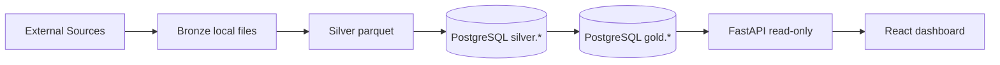
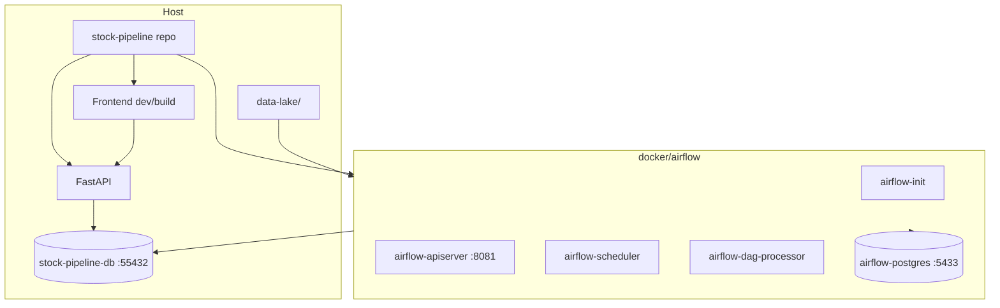
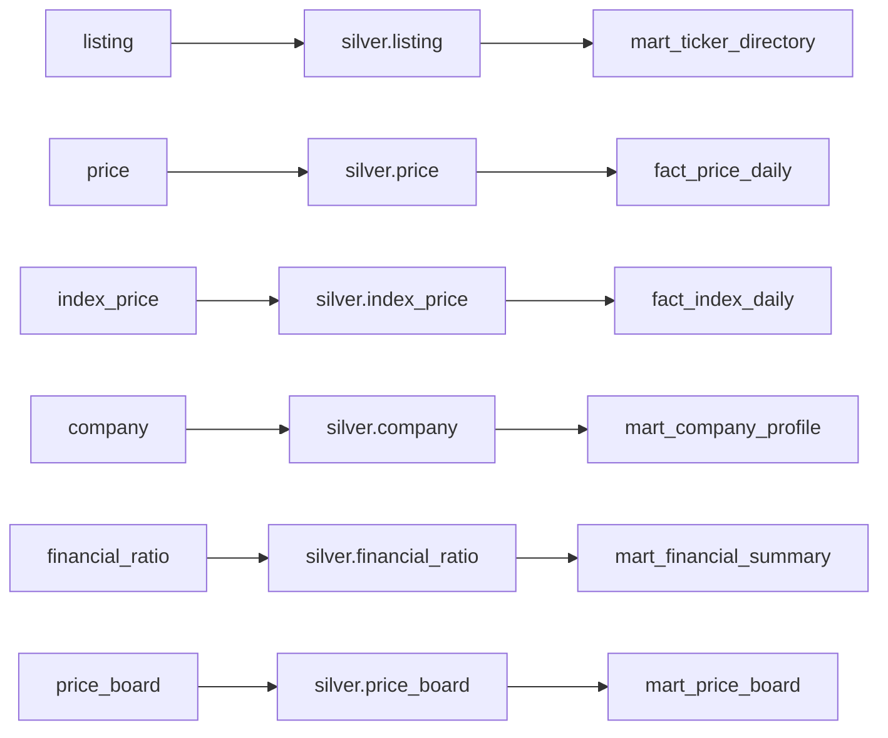

# Stock Pipeline Codebase Audit

## 1. Audit Scope

- Scan time: 2026-07-01 (Asia/Ho_Chi_Minh)
- Repository: `stock-pipeline`
- Branch: `main`
- Commit: `075cec9fcbee9e6172ec55eb4e58e057379f6547`
- Audit mode: read-only analysis + new documentation only

### Directories Read

- Root docs and config: `README.md`, `parameters.md`, `pipeline_infor.md`, `.env.example`, `requirements.txt`, `docker-compose.yml`, `dbt_project.yml`, `pytest.ini`
- Ingestion: `ingestion/structure_data/`, `ingestion/unstructured_data/`, `ingestion/semi_structure_data/`, 3 manager notebooks
- Silver: `pipeline/silver/`
- Warehouse: `warehouse/loader/`, `warehouse/ddl/`
- dbt: `transform/dbt/models/`, `transform/dbt/tests/`, `transform/dbt/profiles.yml`, `transform/dbt/dbt_project.yml`
- Airflow: `docker/airflow/dags/`, `docker/airflow/README_airflow.md`, `docker/airflow/docker-compose.airflow.yml`
- Backend: `backend/main.py`, `backend/config.py`, `backend/database.py`, `backend/routers/**`, `backend/schemas/**`
- Frontend: `frontend/package.json`, `frontend/src/**`
- Tests: `tests/**`
- Reference docs: `Docs/Structure_data_flow.md`, `Docs/News_data_flow.md`, `Docs/BCTC_data_flow.md`, `Docs/dbt_outputs_and_lineage.md`

### Directories Skipped

- `.git/`
- `node_modules/`
- `venv/`, `.venv/`
- `__pycache__/`
- generated log/runtime folders under `docker/airflow/logs/`
- compiled frontend bundle under `frontend/dist/`

### Safe Commands Run

- `Get-ChildItem -Force`
- `rg --files ...`
- `git branch --show-current`
- `git rev-parse HEAD`
- `Get-Content -Raw ...`
- `rg -n ...`

### Commands Intentionally Not Run

- No `dbt run`
- No `dbt seed`
- No loader execution
- No DAG execution
- No live ingestion to vnstock, RSS/HTML sources, or HNX
- No database writes

### Areas Not Fully Verifiable In This Audit

- Runtime correctness against a live PostgreSQL instance
- Current external-source behavior from vnstock, RSS/HTML news sites, and HNX
- Current data volume inside local `data-lake/` and database tables
- dbt compiled manifest state if it differs from source SQL

### Audit Output Note

This merged file consolidates the core content from the `Docs/codex-audit/` set into one AI-friendly brief for slide generation or external review.

---

## 2. Executive Summary

`stock-pipeline` is a local, batch-oriented market data platform for Vietnamese equities. The active production path is:

```text
external sources
-> Bronze local files
-> Python Silver transforms
-> PostgreSQL schema silver
-> dbt schema gold
-> FastAPI read-only API
-> React dashboard
```

This is Medallion in layer naming, but technically it is a batch pipeline with mixed ETL and ELT:

- ETL-style step: Python transforms Bronze files into Silver parquet before DB load
- ELT-style step: dbt transforms `silver.*` into `gold.*` inside PostgreSQL

It is not streaming, and it is only "lakehouse-style" rather than a transaction-log lakehouse because Bronze/Silver are local Parquet/PDF files without Delta Lake, Iceberg, or Hudi semantics [E01][E07][E11][E14][E16].

### Data Domains

- Structured market data from vnstock: `price`, `index_price`, `listing`, `company`, `financial_ratio`, `price_board` [E02][E03][E04]
- News from RSS plus HTML crawl: `news` [E05][E09]
- Semi-structured HNX disclosure metadata plus downloaded PDFs: `bctc_pdf_meta` and local PDF files [E06][E09]

### Core Strengths

- Clear orchestration split across 5 DAGs with concrete subset selectors and scheduling [E12]
- Strong replay/idempotency patterns in structured data, price board, loader upserts, and BCTC `doc_id` handling [E03][E04][E06][E10]
- Good separation between analytical serving and UI: frontend calls API only, backend is read-only, and dbt is the main Gold contract [E11][E14][E16]
- Test coverage exists for key transformer and loader contracts, especially news ticker matching, price board dedupe, financial ratio snapshot handling, and dbt incremental contracts [E18]

### Confirmed Limitations

- No streaming or real-time intraday processing [E01]
- No OCR or fact extraction from BCTC PDFs; current BCTC flow is metadata + downloadable file only [E06]
- News sentiment is keyword-based (`keyword_v1`), not ML-based [E05][E09]
- Daily structured DAG defaults to `watchlist50`, not full-market price refresh [E04][E12]
- Several legacy objects still exist in code/docs, especially `int_news_sentiment_daily`, `mart_stock_news_daily`, and legacy Gold DDL in `warehouse/ddl/schema.sql` [E11][E19]

### Five Most Important Findings

1. The current system is more accurately described as batch ETL+ELT, not pure "batch ELT" [E01].
2. `structured_daily` only refreshes `price`, `index_price`, and `price_board`, and by default uses a 50-symbol watchlist; `listing`, `company`, and `financial_ratio` are moved to `structured_monthly` [E04][E12].
3. Backend is read-only over Gold, but the PDF file endpoint is a deliberate exception: metadata comes from Gold, binary content can come from local filesystem via `pdf_path` [E14][E15].
4. The active news mart for API/UI is `mart_stock_news_signal`; `mart_stock_news_daily` and `int_news_sentiment_daily` are legacy/deprecated, though still built [E11][E19].
5. `warehouse/ddl/schema.sql` contains active Silver DDL plus legacy Gold objects; it must not be treated as the source of truth for the current Gold layer [E11][E19].

---

## 3. Repository Map

### Top-Level Structure

```text
stock-pipeline/
├─ ingestion/              Bronze ingestion code + manager notebooks
├─ pipeline/silver/        Bronze -> Silver transforms
├─ warehouse/              PostgreSQL DDL + Silver loader
├─ transform/dbt/          dbt Gold project
├─ docker/airflow/         Airflow orchestration stack and DAGs
├─ backend/                FastAPI read-only API
├─ frontend/               React/Vite dashboard
├─ tests/                  Pytest coverage for contracts and transformers
├─ Docs/                   Project docs and thesis material
├─ docker-compose.yml      Warehouse PostgreSQL/TimescaleDB
├─ dbt_project.yml         Root dbt launcher
├─ parameters.md           Configuration summary doc
└─ pipeline_infor.md       Expanded flow summary doc
```

### Role of Each Main Area

| Path | Role |
| --- | --- |
| `ingestion/structure_data/` | vnstock ingestion for listing, price, index, company, financial_ratio, price_board |
| `ingestion/unstructured_data/` | RSS + HTML crawl for news |
| `ingestion/semi_structure_data/` | HNX disclosure crawl and PDF download |
| `pipeline/silver/` | Transform raw Bronze files into Silver contracts |
| `warehouse/loader/` | Read Silver parquet, normalize types, upsert into `silver.*`, write `silver.load_audit` |
| `transform/dbt/models/` | Build staging, intermediate, fact, dimension, and mart models in `gold` |
| `docker/airflow/dags/` | 5 scheduled DAGs orchestrating Bronze -> Silver -> load -> dbt |
| `backend/routers/` | Registered HTTP endpoints, all GET-only |
| `frontend/src/` | Routes, hooks, components, and API clients |
| `tests/` | Unit/contract tests; some DB/network checks are conditional |

### Entry Points

| Layer | Entry point |
| --- | --- |
| Structured Bronze | `run_structure_ingestion_pipeline()` in `ingestion/structure_data/pipeline.py` |
| News Bronze | `ingest_news()` in `ingestion/unstructured_data/news_ingestor.py` |
| BCTC Bronze | `run_bctc_annual_pipeline()` in `ingestion/semi_structure_data/pipeline.py` |
| Silver CLI | `python -m pipeline.silver.cli` |
| Loader CLI | `python -m warehouse.loader.cli load-silver` |
| dbt | `dbt run --project-dir transform/dbt --profiles-dir transform/dbt` |
| Airflow | `docker/airflow/dags/*.py` |
| FastAPI | `backend.main:app` |
| Frontend | `frontend/src/main.tsx` + `frontend/src/App.tsx` |

---

## 4. Architecture

### Overall Architecture

The active architecture chain is:

```text
External sources
-> Bronze local Parquet/PDF
-> Python Silver transforms
-> PostgreSQL silver.*
-> dbt gold.*
-> FastAPI read-only
-> React dashboard
```

### Layer Boundaries

| Layer | Physical form | Main code |
| --- | --- | --- |
| Bronze | Local Parquet/PDF | `ingestion/**` |
| Silver file layer | Local Parquet | `pipeline/silver/**` |
| Silver DB layer | PostgreSQL `silver.*` | `warehouse/loader/**` |
| Gold | PostgreSQL `gold.*` | `transform/dbt/models/**` |
| Serving | FastAPI GET endpoints | `backend/**` |
| UI | React app over HTTP API | `frontend/**` |

### Mermaid: End-to-End



Short note: the codebase uses Medallion naming, but Bronze and Silver are file-based rather than log-backed lakehouse tables.

### Mermaid: Local Deployment



Short note: Airflow metadata Postgres is separate from the warehouse Postgres.

---

## 5. Dataset Catalog

| Dataset | Source | Bronze | Silver | Silver Table | Gold | API | UI |
| --- | --- | --- | --- | --- | --- | --- | --- |
| `price` | vnstock `Quote.history` | `raw/Structure_Data/price/year=*/month=*/TICKER.parquet` | `silver/price/trading_date=*` | `silver.price` | `stg_price -> int_price_indicator -> fact_price_daily -> mart_stock_daily`, `mart_market_overview`, `mart_company_profile` | `/prices/{symbol}`, `/indicators/{symbol}`, `/market/overview` | Stock chart, indicators, dashboard |
| `index_price` | vnstock `Quote.history` | `raw/Structure_Data/index/year=*/month=*/INDEX.parquet` | `silver/index_price/trading_date=*` | `silver.index_price` | `stg_index_price -> fact_index_daily -> mart_market_overview` | `/market/overview` | Dashboard index cards |
| `listing` | vnstock `Listing.*` | `raw/Structure_Data/listing/master/listing.parquet` | `silver/listing/current` | `silver.listing` | `stg_listing -> dim_security -> mart_ticker_directory`; also joins into `dim_company` | `/tickers`, `/companies/{symbol}` fallback enrichment | Search and company context |
| `company` | vnstock `Company.overview/profile` | `raw/Structure_Data/company/snapshots/snapshot_date=*/company_overview.parquet` | `silver/company/current` | `silver.company` | `stg_company -> dim_company -> mart_company_profile` | `/companies/{symbol}` | Stock overview |
| `financial_ratio` | vnstock `Finance.ratio` | `raw/Structure_Data/financial_ratio/snapshot_date=*/TICKER.parquet` | `silver/financial_ratio/period_type=*/year=*` | `silver.financial_ratio` | `stg_financial_ratio -> mart_financial_summary`, `mart_company_profile` | `/financials/{symbol}` | Financial tab |
| `price_board` | vnstock `Trading.price_board` | `raw/Structure_Data/price_board/snapshot_at=*/PRICE_BOARD_SNAPSHOT.parquet` | `silver/price_board/trading_date=*` | `silver.price_board` | `stg_price_board -> mart_price_board` | `/board/{symbol}`, `/board/{symbol}/foreign-flow` | Price board and foreign flow |
| `news` | RSS + HTML | `raw/Unstructured_Data/news/{rss,html}/date=*` | `silver/news/date=*` | `silver.news` | `stg_news -> fact_news_article`, `mart_stock_news_signal`; legacy `int_news_sentiment_daily`, `mart_stock_news_daily` | `/news/articles`, `/news/market`, `/news/{symbol}`, `/news/{symbol}/signal`, `/news/{symbol}/articles` | News archive, dashboard feed, stock news |
| `bctc_pdf_meta` + PDF | HNX disclosure | `raw/Semi_Structure_Data/bctc_annual_pdf_meta/source=hnx/date=*` and local PDFs | `silver/bctc_pdf_meta/date=*` | `silver.bctc_pdf_meta` | `stg_bctc_pdf_meta -> mart_bctc_documents` | `/bctc/documents`, `/bctc/recent`, `/bctc/{symbol}`, `/bctc/{symbol}/file/{doc_id}` | BCTC archive and stock BCTC panel |

---

## 6. Structured Flow

### Scope

Structured flow covers 6 datasets:

- `price`
- `index_price`
- `listing`
- `company`
- `financial_ratio`
- `price_board`

### Ingestion Summary

| Dataset | Source module | Entry point | Fallback | Retry/rate limit | Output |
| --- | --- | --- | --- | --- | --- |
| `price` | `ingestion/structure_data/price_ingestor.py` | `ingest_prices()` | `kbs -> vci` | `call_with_retry`, `wait_for_rate_limit(50 rpm)` | monthly parquet by ticker |
| `index_price` | `ingestion/structure_data/index_ingestor.py` | `ingest_indices()` | `kbs -> vci` | same as price | monthly parquet by index |
| `listing` | `ingestion/structure_data/stock_info_ingestor.py` | `ingest_listing()` | source loop over resolved sources | retry + rate limit | single master parquet |
| `company` | `ingestion/structure_data/stock_info_ingestor.py` | `ingest_company_overview()` | source order `kbs` first, then others | retry + rate limit | snapshot parquet |
| `financial_ratio` | `ingestion/structure_data/stock_info_ingestor.py` | `ingest_financial_ratio()` | source order `kbs` first, then others | retry + disable bad source on transient/incompatible errors | snapshot parquet per ticker |
| `price_board` | `ingestion/structure_data/stock_info_ingestor.py` | `ingest_price_board()` or `_ingest_price_board_snapshot()` | source loop | retry + rate limit | one snapshot parquet per run |

### Bronze Contracts

| Dataset | Bronze path | Partitioning | Write mode | Notes |
| --- | --- | --- | --- | --- |
| `listing` | `listing/master/listing.parquet` | none | overwrite snapshot | Bronze keeps all instrument types; Silver filters to stock |
| `price` | `price/year=YYYY/month=MM/TICKER.parquet` | trading month | merge existing monthly file | per-ticker/date dedupe on merge |
| `index_price` | `index/year=YYYY/month=MM/INDEX.parquet` | trading month | merge existing monthly file | 5 fixed indices |
| `company` | `company/snapshots/snapshot_date=RUN_DATE/company_overview.parquet` | run date | new snapshot | current snapshot later selected in Silver |
| `financial_ratio` | `financial_ratio/snapshot_date=TOKEN/TICKER.parquet` | snapshot token | new snapshot | preserves full timestamp watermark |
| `price_board` | `price_board/snapshot_at=TS/PRICE_BOARD_SNAPSHOT.parquet` | run timestamp | one file per run | deduped to latest snapshot per day in Silver |

### Structured Daily vs Monthly

| DAG | Dataset scope | Universe | Incrementality |
| --- | --- | --- | --- |
| `structured_daily` | `price`, `index_price`, `price_board` | default `watchlist50` via `DEFAULT_PRICE_BOARD_TICKERS`; optional `STRUCTURED_DAG_UNIVERSE=listing` | price daily window = 2 days, per-ticker Bronze watermark enabled |
| `structured_monthly` | `listing`, `company`, `financial_ratio` | full HOSE/HNX stock universe | snapshot refresh, not daily incremental |

### Mermaid: Structured Flow



Short note: `listing` also supplies the ticker universe for `company`, `financial_ratio`, and optionally `price`/`price_board`.

### Key Confirmations

1. Structured processing is batch, not streaming.
2. Bronze is not loaded straight into PostgreSQL.
3. Daily structured DAG defaults to 50 symbols, not full market.
4. `dbt` reads `silver.*`, not Bronze/Silver Parquet directly.

---

## 7. Suggested AI Prompt Context

If you want to send this file to another AI to propose thesis-defense slides, tell it to focus on:

- project goal and business scope
- end-to-end architecture
- Medallion layer explanation
- 3 data domains: structured, news, BCTC
- orchestration with Airflow DAG split
- API + frontend serving model
- confirmed limitations and future extensions
- design trade-offs: batch snapshot now, streaming later

Suggested one-line prompt:

```text
Use this audit brief to propose a clear Vietnamese thesis-defense slide deck for the stock-pipeline project, emphasizing architecture, data flow, system strengths, limitations, and future streaming expansion.
```

---

## 8. Evidence Index

| ID | Conclusion | File | Symbol / model / DAG | Status | Confidence |
| --- | --- | --- | --- | --- | --- |
| E01 | Active architecture is Bronze files -> Silver parquet -> `silver.*` -> dbt `gold.*` -> FastAPI -> React; mixed ETL + ELT, not pure ELT | `README.md`, `ingestion/structure_data/pipeline.py`, `warehouse/loader/silver_loader.py`, `transform/dbt/models/**`, `backend/main.py`, `frontend/src/App.tsx` | architecture | active | high |
| E02 | Structured entry point is `run_structure_ingestion_pipeline()` with `listing-as-universe` branch | `ingestion/structure_data/pipeline.py` | structured Bronze | active | high |
| E03 | `price` uses source fallback, watermark resolution, and monthly merge by ticker | `ingestion/structure_data/price_ingestor.py`, `ingestion/structure_data/common.py` | `price` | active | high |
| E04 | `structured_daily` defaults to watchlist50 and only covers `price`, `index_price`, `price_board` | `docker/airflow/dags/common/tasks.py`, `docker/airflow/dags/structured_daily.py` | `structured_daily` | active | high |
| E05 | News Bronze is RSS + HTML, partitioned by `run_date`; Silver computes keyword sentiment | `ingestion/unstructured_data/news_ingestor.py`, `rss_adapter.py`, `html_list_adapter.py`, `pipeline/silver/news_transformer.py` | `news` | active | high |
| E06 | BCTC is HNX metadata + PDF download only; no OCR/fact extraction path | `ingestion/semi_structure_data/pipeline.py`, `providers/hnx_disclosure_provider.py`, `downloader.py` | `bctc` | active | high |
| E07 | Silver structured contracts and incremental watermark logic are implemented in code | `pipeline/silver/price_transformer.py`, `structure_transformer.py`, `financial_ratio_transformer.py`, `price_board_transformer.py` | Silver structured | active | high |
| E08 | Silver listing/company/financial_ratio/price_board use explicit dedupe/current/latest rules | `pipeline/silver/structure_transformer.py`, `financial_ratio_transformer.py`, `price_board_transformer.py` | Silver current/snapshot datasets | active | high |
| E09 | Silver `news` and `bctc_pdf_meta` use `article_id` and `doc_id` as serving contracts | `pipeline/silver/news_transformer.py`, `bctc_pdf_meta_transformer.py` | `news`, `bctc_pdf_meta` | active | high |
| E10 | Loader upserts all 8 datasets, validates keys, and writes `silver.load_audit` | `warehouse/loader/silver_loader.py`, `warehouse/loader/cli.py`, `warehouse/ddl/schema.sql` | loader | active | high |
| E11 | Current Gold source of truth is dbt models; 4 incremental models; `mart_stock_news_daily` is deprecated | `transform/dbt/dbt_project.yml`, `transform/dbt/models/**`, `transform/dbt/models/marts/schema.yml` | dbt | active | high |
| E12 | There are exactly 5 active DAGs with explicit schedules and dbt selectors | `docker/airflow/dags/*.py`, `docker/airflow/dags/common/tasks.py` | Airflow | active | high |
| E13 | FastAPI registers 10 routers and allows only GET methods through CORS config | `backend/main.py` | API shell | active | high |
| E14 | Backend queries Gold models/facts directly and maps them to endpoint contracts | `backend/routers/**` | API query path | active | high |
| E15 | BCTC file endpoint is a Gold-metadata plus local-file serving exception | `backend/routers/bctc.py` | `/bctc/{symbol}/file/{doc_id}` | active | high |
| E16 | Frontend uses React Router + Axios over `VITE_API_URL`; no direct DB/file access | `frontend/src/main.tsx`, `frontend/src/App.tsx`, `frontend/src/api/**` | frontend | active | high |
| E17 | Local deployment uses two Postgres services: warehouse `:55432` and Airflow metadata `:5433` | `docker-compose.yml`, `docker/airflow/docker-compose.airflow.yml` | deployment | active | high |
| E18 | Test coverage exists for dbt incremental contracts, listing universe, watermarks, news matching, price board, financial ratio, and loader prep | `tests/**` | tests | active | high |
| E19 | Legacy/deprecated artifacts remain: `int_news_sentiment_daily`, `mart_stock_news_daily`, legacy Gold DDL, `DBT_STRUCTURED_SELECT_FULL` | `transform/dbt/models/intermediate/int_news_sentiment_daily.sql`, `transform/dbt/models/marts/mart_stock_news_daily.sql`, `warehouse/ddl/schema.sql`, `docker/airflow/dags/common/tasks.py` | legacy | active-but-not-primary | high |
| E20 | Configuration drift exists between docs, notebooks, class defaults, and DAG defaults; `NEWS_RATE_LIMIT_RPM` and `HNX_DISCLOSURE_API_URL` are especially easy to misstate | `parameters.md`, notebooks, `ingestion/semi_structure_data/config.py`, `docker/airflow/dags/common/tasks.py`, `frontend/src/api/client.ts` | config | active | medium |
