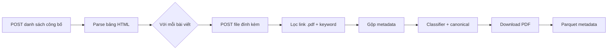

# Semi-structured Ingestion: BCTC Annual PDFs

Module này chỉ thu thập PDF báo cáo tài chính từ HNX và ghi metadata để phục vụ lưu trữ, kiểm chứng, hoặc xử lý thủ công về sau.

Stage 2 parse PDF/OCR đã bị loại bỏ khỏi luồng này vì dữ liệu trích từ PDF scan và bảng BCTC không đủ ổn định cho pipeline phân tích hiện tại. Nếu cần dữ liệu tài chính có cấu trúc, nên ưu tiên nguồn structured/API riêng thay vì parse PDF.

## Tóm Tắt Luồng Crawl PDF

### Nguồn dữ liệu

| Thứ tự | Nguồn | Mô tả |
|--------|--------|--------|
| 1 | **HNX live** (`www.hnx.vn`) | Crawl chính thức — không cần khai báo URL thủ công |
| 2 | `data/hnx_sample.json` | Bản ghi mẫu / offline (hoặc `cfg.hnx_sample_json`) |
| 3 | `data/hnx_urls.csv` | URL PDF hàng loạt (hoặc `cfg.hnx_urls_csv`) |

Ba nguồn được **gộp** trong `fetch_hnx_annual_bctc_documents`, **dedupe theo `url_pdf`** (ưu tiên bản xuất hiện trước). Hiện chỉ hỗ trợ `source=hnx`; HOSE/UPCOM chưa có provider.

`cfg.hnx_disclosure_api_url` / `HNX_DISCLOSURE_API_URL` **không** dùng cho crawl danh sách — endpoint cố định trên site HNX.

### Cơ chế thu thập (HNX live)

Dùng **`requests.Session`** + **BeautifulSoup** parse HTML fragment (không Selenium).



**Bước 1 — Danh sách công bố (phân trang)**

- **URL:** `POST https://www.hnx.vn/ModuleArticles/ArticlesCPEtfs/NextPageTinCPNY_CBTCPH`
- **Body form:** `pNumPage`, `pNhomTin` = *"Báo cáo tài chính, Giải trình báo cáo tài chính"*, `pTieuDeTin` = *"báo cáo tài chính"*, `pMaChungKhoan` (chỉ điền khi `cfg.tickers` có đúng **1** mã), `pFromDate`/`pToDate` để trống → lấy toàn bộ lịch sử theo phân trang.
- **Parse:** mỗi `<tr>` lấy `ticker`, `title`, `published_at`, `article_id` từ `onclick` (`funcViewDetailArticlesByID` / `ShowFileAttach`) hoặc `data-*`.
- **Dừng crawl:** trang trả về 0 dòng hợp lệ, hoặc đạt `HNX_CRAWL_MAX_LIST_PAGES`.

**Bước 2 — File PDF đính kèm (theo `article_id`)**

- **URL:** `POST https://www.hnx.vn/ModuleArticles/ArticlesCPEtfs/ArticlesFileAttach`
- **Body:** `pArticlesID=<article_id>`
- **Parse:** mọi `<a href*="pdf">` → URL tuyệt đối; cache theo `article_id` để không gọi lại cùng bài.
- **Lọc sớm (attachment):** keyword trên `attachment_name` + `title` + `url_pdf` (xem [Tóm Tắt Logic Lọc](#tóm-tắt-logic-lọc-hiện-tại-crawldownload-bctc-pdf)).

**Bước 3 — Download**

- `download_pdf_to_path`: stream → `<doc_id>.pdf.part`, resume `Range`, retry/backoff, kiểm tra header `%PDF-`, `Content-Length`, tối thiểu `min_pdf_bytes` (mặc định 20 000).
- Rate limit chung: `rate_limit_rpm=10` (crawl + download).

### Lấy bao nhiêu / giới hạn

| Tham số | Mặc định | Ý nghĩa |
|---------|----------|---------|
| `HNX_CRAWL_MAX_LIST_PAGES` | `500` (cap) | Số trang danh sách tối đa; notebook manager đặt `100` |
| `HNX_RESUME_FROM_STATE` | tắt | `1` → đọc `data-lake/raw/Semi_Structure_Data/_state/hnx_crawl_state.json`, tiếp tục từ `last_success_page + 1` |
| `cfg.tickers` | `[]` (tất cả) | Lọc sau crawl; nếu **1** ticker → gửi luôn `pMaChungKhoan` lên HNX |
| `rate_limit_rpm` | `10` | Giới hạn request/phút |
| `api_retry_max_attempts` | `4` | Retry POST list/attach |
| `download_retry_max_attempts` | `3` | Retry tải PDF |
| `request_timeout_sec` | `45` | Timeout HTTP |

**Số lượng bản ghi** không cố định: phụ thuộc số trang HNX trả về × số PDF/bài × lọc keyword. Mỗi URL PDF hợp lệ = 1 dòng metadata; download chỉ áp dụng subset sau classifier (mặc định BCTC VI).

### Nguồn bổ sung (offline / thủ công)

- **`hnx_sample.json`:** mảng `records`/`items` hoặc list object `{ticker, title, url_pdf, ...}` — dùng khi dev không crawl được HNX hoặc cần case test.
- **`hnx_urls.csv`:** cột `url_pdf` (bắt buộc), tùy chọn `ticker`, `title`, `published_at`, `year`, `url_detail`. Nếu thiếu `title`, tự sinh từ ticker/year.

Hai file này **không** thay crawl live; chỉ **bổ sung** URL sau khi dedupe.

### Điều phối qua notebook

[`ingestion/ingest_bctc_pdf_manager.ipynb`](../ingest_bctc_pdf_manager.ipynb):

1. Setup UTF-8 + `sys.path` về repo root.
2. (Tuỳ chọn) `HNX_CRAWL_MAX_LIST_PAGES=100`, `.env` cho SSL.
3. `SemiStructuredIngestionConfig(sources=["hnx"], hnx_verify_ssl=False, strict_bctc_annual_keyword_filter=False)` — dev: crawl được trên Windows, giữ nhiều PDF để khảo sát.
4. `run_bctc_annual_pipeline(cfg, include_download=True)` → `ingest_bctc_annual_pdfs`.

Production gợi ý: `hnx_verify_ssl=True` / `HNX_SSL_VERIFY=1`, có thể `strict_bctc_annual_keyword_filter=True` để thu hẹp BCTC năm ngay từ crawler.

## Luồng Hiện Tại

1. `run_bctc_annual_pipeline` gọi `ingest_bctc_annual_pdfs` khi `include_download=True`.
2. `fetch_hnx_annual_bctc_documents` crawl danh sách công bố từ HNX, mở trang chi tiết và lấy URL PDF.
3. `document_classifier.py` chuẩn hóa tiêu đề, phân loại tài liệu và chọn bản canonical trong mỗi nhóm `(ticker, period_key)`.
4. `download_pdf_to_path` tải PDF theo cơ chế stream-to-disk, resume `.part`, retry/backoff, kiểm tra header PDF và content length.
5. Metadata được ghi ra Parquet theo partition ngày chạy.

## Output

- Raw PDF:
  `data-lake/raw/Semi_Structure_Data/bctc_annual_pdf/source=hnx/date=<run_date>/ticker=<TICKER>/year=<YYYY|UNKNOWN>/<doc_id>.pdf`
- Metadata:
  `data-lake/raw/Semi_Structure_Data/bctc_annual_pdf_meta/source=hnx/date=<run_date>/PART-000.parquet`
- Bootstrap marker:
  `data-lake/raw/Semi_Structure_Data/bctc_annual_pdf/source=hnx/_full_bootstrap_done.json`

## Cách Chạy

Trong notebook manager hoặc Python script:

```python
from ingestion.common import configure_logging
from ingestion.semi_structure_data import SemiStructuredIngestionConfig, run_bctc_annual_pipeline

configure_logging()

cfg = SemiStructuredIngestionConfig(sources=["hnx"])
result = run_bctc_annual_pipeline(cfg, include_download=True)
result
```

## Cấu Hình Hay Dùng

- `HNX_CRAWL_MAX_LIST_PAGES=1`: giới hạn số trang crawl khi test.
- `HNX_RESUME_FROM_STATE=1`: tiếp tục crawl từ state cũ.
- `HNX_SSL_VERIFY=0/1`: tắt/bật verify SSL HNX.
- `BCTC_INGEST_ALL_CRAWLED_PDFS=1`: tải mọi PDF crawl được thay vì chỉ nhóm BCTC VI.
- `BCTC_ALLOW_EN_DOCS=1`: cho phép tài liệu EN đi qua filter phân loại.

## Metadata Chính

Các cột quan trọng:

- Định danh: `doc_id`, `source`, `ticker`, `year`, `title`, `published_at`, `url_pdf`, `url_detail`
- File: `pdf_path`, `file_size`, `sha256`, `pdf_valid_header`, `qc_pass`, `status`, `error`
- Download: `http_status`, `content_length`, `bytes_downloaded`, `download_seconds`, `attempts`, `integrity_ok`, `error_class`
- Phân loại: `normalized_title`, `doc_class`, `language`, `is_consolidated`, `is_explanation`, `is_disclosure`, `canonical_priority`, `keep_for_parse`

`keep_for_parse` được giữ trong metadata như dấu hiệu bản canonical, nhưng hiện không còn stage parse sử dụng cột này.

## Tóm Tắt Logic Lọc Hiện Tại (Crawl/Download BCTC PDF)

Luồng lọc hiện tại có **3 tầng chính**: (1) lọc sớm ở crawler HNX, (2) phân loại + chọn canonical, (3) lọc khi quyết định download.

### 1) Lọc sớm tại crawler HNX (providers/hnx_disclosure_provider.py)

**Nguồn dữ liệu:**
- Crawl HNX AJAX (POST phân trang) -> mở trang chi tiết -> lấy danh sách attachment PDF.
- Bổ sung từ `data/hnx_sample.json` và `data/hnx_urls.csv` (nếu có).

**Lọc theo keyword (trước khi đưa vào danh sách tài liệu):**
- Khi `strict_bctc_annual_keyword_filter=True`:
  - Dùng `_is_annual_bctc_candidate`:
    - **Include bắt buộc**: một trong `_INCLUDE_BASE` (ví dụ: `bctc`, `bao cao tai chinh`, `BaoCaoTaiChinh...`).
    - **Include thêm gợi ý năm**: một trong `_INCLUDE_ANNUAL_HINT` (`nam`, `kiem toan`, `da kiem toan`, `hop nhat`).
    - **Exclude** nếu chứa `_EXCLUDE_KEYWORDS` (`nghi quyet`, `resolution`, `EN`).
- Khi `strict_bctc_annual_keyword_filter=False` (mặc định dev):
  - Dùng `_is_bctc_candidate`:
    - **Include** `_INCLUDE_BASE`.
    - **Exclude** `_EXCLUDE_KEYWORDS_BCTC` (`uponrequest`, `tai lieu hop`, `nghi quyet`, `EN`, ...).

**Lọc theo mã cổ phiếu (nếu cấu hình):**
- `cfg.tickers` không rỗng => chỉ giữ ticker nằm trong danh sách này.

**Dedupe URL:**
- Loại trùng `url_pdf` giữa các nguồn (live + sample + csv).

### 2) Phân loại + chọn canonical (document_classifier.py)

**Chuẩn hoá title** (bỏ dấu, lowercase, bỏ ký tự đặc biệt) để áp rule.

**Phân loại tài liệu (doc_class):**
- `financial_statement_consolidated` nếu có cụm từ như `hợp nhất`, `consolidated`.
- `financial_statement_separate` nếu có `báo cáo tài chính`, `parent company`, ...
- `explanation`, `disclosure`, `announcement` nếu khớp nhóm noise (giải trình, CBTT, nghị quyết,...).
- Còn lại: `unknown`.

**Nhận diện ngôn ngữ (language):**
- Ưu tiên marker trong tên file (`_VI_`, `_EN_`) và ký tự tiếng Việt.
- Dùng các marker từ khóa EN/VI để suy luận khi không có ký tự đặc biệt.

**Xác định period_key** (Q1/Q2/Q3/Q4/H1/9M/ANNUAL/GENERAL) từ title + URL để dedupe.

**Chọn canonical:**
- Nhóm theo `(ticker, period_key)`, chọn 1 bản có `canonical_priority` nhỏ nhất.
- Ưu tiên: **Consolidated VI** → **Separate VI** → **Consolidated UNKNOWN** → **Separate UNKNOWN** → (EN nếu được phép).
- Các doc noise/unknown class luôn bị `keep_for_parse=False`.

### 3) Lọc ở bước download (document_classifier.should_download_financial_pdf)

Nếu `ingest_only_financial_statement_vi=True` (mặc định):
- **Chỉ download** doc_class thuộc `financial_statement_consolidated` hoặc `financial_statement_separate`.
- **Ngôn ngữ:**
  - `VI` luôn được tải.
  - `UNKNOWN` chỉ tải nếu `ingest_unknown_language_financial=True` (mặc định).
  - `EN` chỉ tải nếu `allow_en_docs_for_parse=True` hoặc env `BCTC_ALLOW_EN_DOCS=1`.

Nếu `BCTC_INGEST_ALL_CRAWLED_PDFS=1` (hoặc `ingest_only_financial_statement_vi=False`):
- **Bypass filter download**: tải tất cả URL crawl được (trừ URL rỗng).

**Kết quả lọc:**
- Nếu bị skip ở tầng download: metadata vẫn ghi với `status=skipped_ingest_filter` và `error=skip_reason`.
- Nếu pass filter nhưng file lỗi/không đạt QC thì `status=qc_failed` hoặc `download_failed`.

## File Liên Quan

- [`ingest_bctc_pdf_manager.ipynb`](../ingest_bctc_pdf_manager.ipynb): notebook chạy pipeline (config env + `run_bctc_annual_pipeline`).
- `pipeline.py`: điều phối luồng download-only.
- `bctc_annual_pdf_ingestor.py`: crawl + classify + download + ghi metadata.
- `providers/hnx_disclosure_provider.py`: provider HNX.
- `document_classifier.py`: phân loại tài liệu rule-based.
- `downloader.py`, `http_client.py`: download bền vững.
- `config.py`: cấu hình ingestion.
