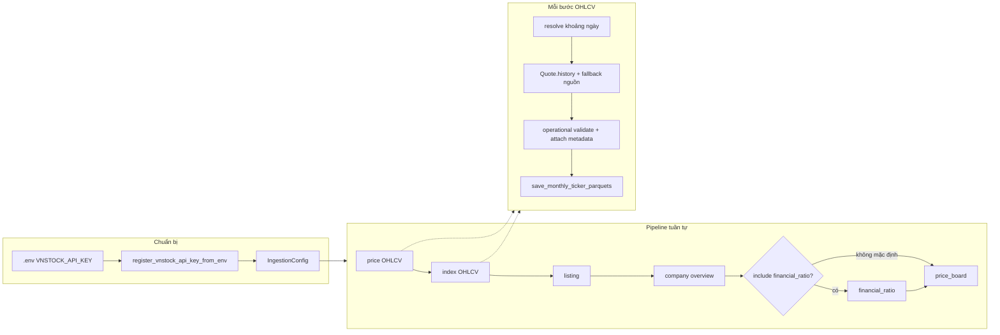

# Structure Data Ingestion

Tài liệu mô tả **luồng ingest dữ liệu có cấu trúc** hiện tại: từ cấu hình → gọi vnstock → QC → ghi `data-lake/raw/Structure_Data/`.

## Luồng tổng thể

1. **Cấu hình** (`IngestionConfig` trong `config.py`): danh sách mã, chỉ số, `primary_source` / `fallback_source`, rate limit, cửa sổ incremental, ngưỡng QC, đường dẫn data lake.
2. **API vnstock**: đăng ký key (`common.register_vnstock_api_key_from_env`), mỗi request qua `wait_for_rate_limit` và `call_with_retry` khi lỗi mạng tạm thời.
3. **Pipeline** (`pipeline.py`): gọi lần lượt các ingestor, **nghỉ** `delay_between_categories_sec` giữa các nhóm để giảm rate limit / lỗi mạng.
4. **Ghi dữ liệu**: Parquet dưới `data-lake/raw/Structure_Data/`. OHLCV (`price`, `index`) partition theo `year=<YYYY>/month=<MM>`; snapshot khác dùng key snapshot riêng, listing vẫn ở `master`.

## 1) Tổng quan file trong thư mục

| File | Vai trò |
|------|---------|
| `config.py` | `IngestionConfig`: tickers, chỉ số, nguồn, rate limit, backfill/incremental, QC, retry, `data_lake_root` |
| `common.py` | Rate limit, retry, gate vận hành OHLCV, gắn metadata ingest, split/lưu Parquet theo tháng giao dịch, watermark/run metadata, nạp `.env`, đăng ký key vnstock |
| `price_ingestor.py` | OHLCV cổ phiếu (`Quote.history`) |
| `index_ingestor.py` | OHLCV chỉ số (cùng pattern với giá) |
| `stock_info_ingestor.py` | Listing, company overview/profile, financial ratio, price board |
| `pipeline.py` | `run_structure_ingestion_pipeline` và biến thể (có/không `financial_ratio`) |

## 2) Thứ tự chạy pipeline (`pipeline.py`)

Mặc định `run_structure_ingestion_pipeline`:

1. `ingest_prices` → pause  
2. `ingest_indices` → pause  
3. `ingest_listing` → pause  
4. `ingest_company_overview` → pause  
5. `ingest_financial_ratio` — **mặc định tắt** (`include_financial_ratio=False`)  
6. `ingest_price_board`

- **`run_structure_full_ingestion_pipeline`**: giống trên nhưng **bật** `financial_ratio`.  
- **`run_financial_ratio_ingestion_pipeline`**: chỉ chạy financial ratio (phù hợp lịch weekly/monthly).

## 3) Chi tiết luồng theo loại dữ liệu

### OHLCV (giá cổ phiếu & chỉ số)

- **API**: `vnstock.Quote(source=..., symbol=...).history(start, end, interval="1D")`.
- **Nguồn**: thử theo thứ tự `resolved_data_sources()` — thường `primary_source` rồi `fallback_source` (mặc định `kbs` → `vci`).
- **Trong một mã**:
  1. `_resolve_*_fetch_range`: chọn `start`/`end` và `range_mode` (full N năm, incremental theo watermark, bootstrap lần đầu, hoặc “full một lần” nếu bật marker).
  2. Gọi API có retry; nếu DataFrame rỗng hoặc **QC không đạt** (`validate_ohlcv_frame` với `min_rows` phụ thuộc full vs incremental) → thử nguồn kế tiếp.
  3. `build_price_like_schema` chỉ gắn metadata (`ticker`, `source`, `instrument_type`, `ingested_at`, `fetched_at`) + log chất lượng.
  4. `save_monthly_ticker_parquets` chuẩn hóa cột ngày đủ để split theo từng tháng giao dịch, rồi ghi đè file của mã đó trong `year=<YYYY>/month=<MM>`.
  5. Pipeline ghi `_runs/<run_id>.json` cho từng nhóm OHLCV. File `_watermark.json` được đọc để chọn incremental range, nhưng code ingestion hiện tại không tự ghi watermark; watermark được cập nhật sau khi Silver CLI chạy thành công cho `price` hoặc `index_price`.

**Boundary Bronze/Silver**: Structure ingestion chỉ giữ gate vận hành để retry/fallback, gắn metadata tối thiểu và chuẩn hóa `trading_date` ở mức cần cho partition. Khi ghi lại tháng đã có, Bronze có merge/dedupe theo mã + `trading_date` để tránh trùng file tháng, nhưng các biến đổi analytics-ready như ép kiểu OHLCV, derive `value`, `value_is_derived`, `is_suspicious`, uppercase ticker/symbol, compact text, dedupe chuẩn và thứ tự cột chuẩn nằm ở `pipeline/silver/`.

### Listing / company / financial ratio / price board

- **Listing**: `Listing` (ưu tiên `symbols_by_exchange` với tham số tương thích phiên bản vnstock). Kết quả là raw-ish **snapshot**: ghi đè file master; filter stock, cleanup exchange/symbol và dedupe nằm ở Silver.
- **Company**: thử `Company.overview` rồi `profile` theo từng source; thứ tự source ưu tiên KBS trước (giảm lỗi tương thích VCI). Ghi snapshot theo `snapshot_date=<run_date>`; compact text, ép kiểu và current dedupe nằm ở Silver.
- **Financial ratio**: `Finance.ratio`; có retry và tùy chọn tắt nguồn khi lỗi transient / abort sau N lỗi liên tiếp (theo field trong `IngestionConfig`).
- **Price board**: `Trading.price_board` → một file snapshot theo partition timestamp chạy.

## 4) Dữ liệu lấy và output

### A) Giá cổ phiếu (OHLCV)

- API: `vnstock.Quote.history`
- Output:
  - `data-lake/raw/Structure_Data/price/year=<YYYY>/month=<MM>/<TICKER>.parquet`
  - `data-lake/raw/Structure_Data/price/_runs/<run_id>.json`

### B) Chỉ số (VNINDEX/VN30/HNX...)

- API: `vnstock.Quote.history`
- Output:
  - `data-lake/raw/Structure_Data/index/year=<YYYY>/month=<MM>/<INDEX_CODE>.parquet`
  - `data-lake/raw/Structure_Data/index/_runs/<run_id>.json`

### Bổ sung metadata OHLCV

- Watermark chung cho raw Structure OHLCV:
  - `data-lake/raw/Structure_Data/_watermark.json`
- `_watermark.json` được dùng trong `_resolve_*_fetch_range` cùng watermark từ Silver/Gold để chọn khoảng incremental. Với code hiện tại, file này được cập nhật bởi `pipeline.silver.cli` sau khi transform `price` hoặc `index_price` thành công, không phải bởi riêng notebook/crawler ingestion.
- `_runs/<run_id>.json` ghi `run_type`, `ingested_at`, `trading_date_from`, `trading_date_to`, `tickers`, `row_count`, `status`.

### C) Listing

- API: `vnstock.Listing.symbols_by_exchange` hoặc `all_symbols`
- Output (snapshot, **ghi đè** mỗi lần chạy):
  - `data-lake/raw/Structure_Data/listing/master/listing.parquet`

### D) Company overview

- API: `vnstock.Company.overview` / `profile`
- Output (**snapshot**, ghi đè nếu cùng `snapshot_date`):
  - `data-lake/raw/Structure_Data/company/snapshots/snapshot_date=<run_date>/company_overview.parquet`
  - Cột/metadata thêm: `snapshot_date`, `fetched_at`, `source`, `company_method`

### E) Financial ratio

- API: `vnstock.Finance.ratio` (period `quarter`/`year` theo code ingestor)
- Output:
  - `data-lake/raw/Structure_Data/financial_ratio/snapshot_date=<run_date>/<TICKER>.parquet`

### F) Price board snapshot

- API: `vnstock.Trading.price_board`
- Output:
  - `data-lake/raw/Structure_Data/price_board/snapshot_at=<run_datetime>/PRICE_BOARD_SNAPSHOT.parquet`

**Ghi chú `run_date`**: lấy từ `IngestionConfig.run_partition` nếu set, không thì `date.today().isoformat()`. Với `price`/`index`, giá trị này là `run_id`/metadata ingest, không còn là partition chính. Với `financial_ratio` và `company`, `run_date` là `snapshot_date`; `price_board` dùng `snapshot_at=<run_datetime>`.

## 5) Cơ chế Initial Load vs Incremental (OHLCV)

### Initial Load (full history)

- Khi `use_incremental_window=False`, hoặc
- Chưa có file parquet trước đó cho mã đó (trong mọi `year=*/month=*/`) và `bootstrap_full_history_if_missing=True`
- Khoảng thời gian: từ `start_date` (≈ `years_back` năm) đến `end_date` (hôm nay)

### Incremental Load

- Khi `use_incremental_window=True`
- Nếu có watermark từ Gold/Silver/raw → lấy từ ngày kế tiếp sau `max(trading_date)` đến `end_date`
- Nếu chưa có watermark nhưng **đã có** file cho mã đó trong category → fallback về cửa sổ `incremental_window_days` gần nhất
- QC dùng ngưỡng thấp hơn:
  - `min_ohlcv_rows_stock_incremental`
  - `min_ohlcv_rows_index_incremental`
- Gate vận hành tự co theo `incremental_window_days`: ví dụ daily
  incremental 1 ngày chỉ yêu cầu tối thiểu 1 dòng hợp lệ; DQ chi tiết
  vẫn thuộc Silver.

### Full bootstrap once then incremental (tùy chọn)

- Nếu bật `full_bootstrap_once_then_incremental=True` (và vẫn bật incremental)
- Lần đầu: full history → tạo marker `_full_bootstrap_done.json` dưới `Structure_Data/<category>/`
- Các lần sau: chuyển sang incremental

## 6) Chạy từ Python

### Chạy toàn bộ (trừ financial_ratio)

- Hàm: `run_structure_ingestion_pipeline` (`pipeline.py`)

### Chạy đầy đủ (bao gồm financial_ratio)

- Hàm: `run_structure_full_ingestion_pipeline`

### Chạy riêng financial_ratio

- Hàm: `run_financial_ratio_ingestion_pipeline`

## 7) Notebook điều phối (`ingestion/ingest_structure_data_manager.ipynb`)

- **UTF-8**: cấu hình stdout/stderr và xử lý lỗi encoding trên Windows.
- **Reload module**: `importlib.reload` các submodule `structure_data` để sửa code Python không bị cache kernel.
- **`register_vnstock_api_key_from_env("VNSTOCK_API_KEY")`**: đọc `stock-pipeline/.env` (mẫu có thể tham chiếu `.env.example`).
- **Cấu hình**: gán `cfg.tickers`, `cfg.index_tickers`, `rate_limit_rpm`, `inter_request_delay_sec`, v.v.
- **Profile**: `RUN_PROFILE = "backfill" | "daily_incremental"` — áp `PROFILE_OVERRIDES` (ví dụ backfill tắt incremental; daily_incremental bật cửa sổ ngắn).
- **Thực thi**: chạy từng ô `ingest_*` hoặc một lệnh `run_structure_ingestion_pipeline(cfg)` (có nghỉ giữa nhóm API).

## 8) Hành vi ghi file (tóm tắt)

| Khu vực | Hành vi |
|---------|---------|
| `price/`, `index/` theo `year=<YYYY>/month=<MM>/` | Mỗi file chứa toàn bộ rows của một mã/chỉ số trong tháng đó. Nếu overlap, file tháng được merge/dedupe theo mã + `trading_date` rồi **ghi đè**. |
| `financial_ratio/` theo `snapshot_date=<run_date>/` | Mỗi lần chạy cùng snapshot date: file tương ứng được **ghi đè**. |
| `price_board/` theo `snapshot_at=<run_datetime>/` | Mỗi snapshot ghi vào partition timestamp riêng. |
| `Structure_Data/_watermark.json` | Watermark vận hành cho incremental. Ingestion đọc file này; Silver CLI cập nhật file sau khi transform thành công. |
| `<category>/_runs/<run_id>.json` | Audit run OHLCV do ingestion pipeline ghi. |
| `listing/master/listing.parquet` | **Ghi đè** snapshot. |
| `company/snapshots/snapshot_date=<run_date>/company_overview.parquet` | **Ghi đè** snapshot cùng `snapshot_date`; không append master. |

## 9) Bronze sang Silver hiện tại

Structured Silver hiện xử lý đủ 6 dataset từ Bronze structured:

- `price` → `data-lake/silver/price/trading_date=<YYYY-MM-DD>/PART-000.parquet`
- `index` → `data-lake/silver/index_price/trading_date=<YYYY-MM-DD>/PART-000.parquet`
- `listing` → `data-lake/silver/listing/current/PART-000.parquet`
- `company` → `data-lake/silver/company/current/PART-000.parquet`
- `financial_ratio` → `data-lake/silver/financial_ratio/period_type=<quarter|annual>/year=<YYYY>/PART-000.parquet`
- `price_board` → `data-lake/silver/price_board/trading_date=<YYYY-MM-DD>/PART-000.parquet`

`financial_ratio` được melt từ dạng wide theo kỳ sang dạng long theo `ticker + item_code + period`.
`price_board` hiện dùng grain daily latest: dedupe theo `symbol + trading_date`, giữ snapshot mới nhất trong ngày.

Các phần chưa nằm trong structured Silver: load PostgreSQL/TimescaleDB, dbt Gold marts, chỉ báo kỹ thuật Gold và API/frontend đọc Gold.
