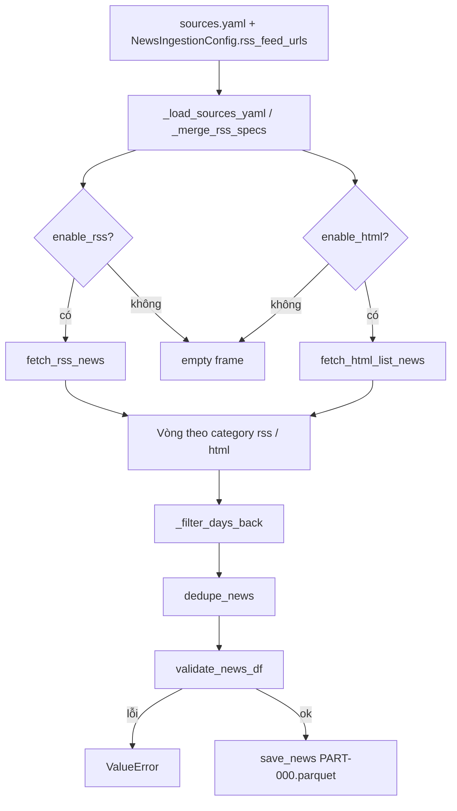

# Unstructured Data — Luồng ingest tin tức

Tài liệu mô tả **cụ thể** luồng lấy và lưu tin tức trong `ingestion/unstructured_data`, bám theo code hiện tại (`news_ingestor.py`, adapters, `schema.py`, `config.py`, `sources.yaml`).

## 1. Vai trò từng file

| File | Vai trò |
|------|---------|
| `config.py` | `NewsIngestionConfig`: bật/tắt RSS/HTML, cửa sổ thời gian, giới hạn bài viết, rate limit, retry HTTP, ticker matching, đường dẫn data lake. |
| `sources.yaml` | Danh sách `rss_feeds` và `html_sources` (URL, CSS, khối `detail`, `enabled`, `headers` tùy chọn). |
| `news_ingestor.py` | Orchestrator: đọc YAML + merge URL RSS từ config → gọi hai adapter → lọc theo ngày → dedupe → validate → ghi Parquet. |
| `rss_adapter.py` | Tải XML RSS bằng `requests`, parse `feedparser`, map entry → một dòng theo schema. |
| `html_list_adapter.py` | Tải trang list HTML, `BeautifulSoup` + `link_css` lấy link; tùy chọn tải từng trang chi tiết theo CSS trong `detail`. |
| `schema.py` | Cột chuẩn `NEWS_COLUMNS`, chuẩn hóa URL/datetime/text, `compute_article_id`, regex ticker, `dedupe_news`, `validate_news_df`. |
| `validate.py` | Re-export `validate_news_df` cho import gọn. |

## 2. Điểm vào và output

- **Hàm chính**: `ingest_news(cfg: NewsIngestionConfig | None)`.
- **Thư mục gốc tin** (tính từ `config.py`):  
  `{repo}/data-lake/raw/Unstructure_Data/news/`  
  (tên thư mục trong repo là `Unstructure_Data`, không đổi trong code.)
- **Partition theo ngày chạy**: `run_date = date.today().isoformat()` (UTC không dùng cho tên partition; partition là **ngày local** của máy chạy).
- **Hai “category” ghi riêng** (không tách theo từng feed/từng site):
  - `news/rss/date=<run_date>/PART-000.parquet`
  - `news/html/date=<run_date>/PART-000.parquet`

Mỗi lần ghi, nếu `truncate_partition=True` (mặc định), thư mục `date=<run_date>` của category đó được xóa mọi file `PART-*.parquet` và `PART-*.csv` cũ rồi ghi lại **một** file `PART-000.parquet`. Cờ `append_only` không đổi layout: code luôn ghi đúng `PART-000` và log debug rằng `append_only` bị bỏ qua cho layout cố định.

Trước khi ghi, các cột thời gian `published_at`, `fetched_at` được ép kiểu datetime UTC rồi xuất Parquet.

## 3. Sơ đồ luồng tổng thể

## 4. Bước chi tiết trong `ingest_news`

1. **Cấu hình mặc định**: `cfg = NewsIngestionConfig()` nếu không truyền.
2. **Đọc YAML** (`_load_sources_yaml`):
   - Đường dẫn: `cfg.sources_yaml_path` nếu set, không thì `ingestion/unstructured_data/sources.yaml`.
   - Nếu không có file hoặc thiếu **PyYAML** → RSS/HTML từ YAML rỗng (log cảnh báo).
   - `rss_feeds`: phần tử **chuỗi** → coi là URL; phần tử **dict** với `enabled: false` bị bỏ; lấy URL từ `url` / `feed_url` / `link`; `label` tùy chọn từ `label` / `id` / `source`.
   - `html_sources`: chỉ giữ phần tử kiểu `dict` (không lọc `enabled` ở bước load; adapter mới kiểm tra).
3. **Merge RSS** (`_merge_rss_specs`): thêm lần lượt URL từ `cfg.rss_feed_urls` (không trùng), sau đó merge spec từ YAML; nếu URL đã có mà YAML có `label` thì cập nhật `label`.
4. **Fetch song song hai nhánh** (luôn log `"RSS+HTML only"` — nghĩa là không có nguồn API riêng, chỉ hai loại này):
   - `rss_df` nếu `enable_rss` else DataFrame rỗng đúng cột.
   - `html_df` nếu `enable_html` else DataFrame rỗng.
5. **Nếu cả hai đều tắt** → log cảnh báo, trả `{"row_counts": {}}`.
6. **Với mỗi category** (`rss`, `html`):
   - `days_back` = `days_back_rss` / `days_back_html` nếu được set (không `None`), không thì `days_back`.
   - `_filter_days_back(df, days_back, strict=cfg.strict_published_at_days_back)`:
     - **strict=False** (mặc định): giữ dòng có `published_at` null **hoặc** ≥ cutoff; `days_back <= 0` → không lọc theo thời gian.
     - **strict=True**: bỏ `published_at` null; chỉ giữ bài ≥ cutoff khi `days_back > 0`.
   - `dedupe_news`: `drop_duplicates` theo `source` + `article_id`, giữ bản đầu trong cùng nguồn.
   - `validate_news_df`: có lỗi → `ValueError` kèm danh sách issue.
   - `save_news` → thêm key category (đường dẫn parquet) và `row_counts[category]`.

## 5. Nhánh RSS (`rss_adapter.py`)

- Chuẩn bị `fetched_at` một lần (UTC, ISO kết thúc `Z`).
- **Ticker**: nếu `enable_ticker_match`, build regex từ `cfg.resolved_tickers()` (danh sách `tickers` hoặc đọc `listing.parquet` khi `use_listing_tickers=True`, có lọc `exchange`, giới hạn `max_tickers_per_run`).
- Với **mỗi feed** trong `feed_specs`:
  - `wait_for_rate_limit(cfg.rate_limit_rpm)` — dùng bộ đếm **toàn process** trong `ingestion.common` (khoảng cách tối thiểu `60/rpm` giây giữa các lần gọi HTTP qua mọi module dùng chung helper).
  - GET feed với `requests.Session` + headers từ config (`User-Agent`, `Accept-Language`, merge `http_headers`), timeout `timeout_sec`, retry `call_with_retry` (exponential backoff + jitter, chỉ retry lỗi được coi là retryable).
  - Parse bằng `feedparser.parse`.
  - `source`: nếu có `label` trong spec → `{label}_rss` (chữ thường, khoảng trắng → `_`); không thì `rss_{hostname_underscore}`.
  - Giới hạn số entry: `rss_max_per_feed` hoặc `max_articles_per_source` (tối thiểu 1), lấy `entries[:max_per]`.
  - Mỗi entry: lấy `title`, `url` (normalize), bỏ nếu thiếu một trong hai; `summary` từ summary/description (strip HTML); `body_text` từ `content` nếu có (list dict hoặc chuỗi); `published_at` từ nhiều field RSS phổ biến; `ticker` = `infer_ticker` trên title/summary/body; `article_id` = SHA-256 của URL đã chuẩn hóa (hoặc fallback metadata nếu không có URL hợp lệ); `language` cố định `"vi"`; `raw_ref` = JSON toàn bộ object entry.
- Cuối nhánh: `dedupe_news` trên toàn bộ dòng từ mọi feed, nhưng chỉ gộp trùng khi cùng `source` + `article_id`.

## 6. Nhánh HTML (`html_list_adapter.py`)

- Bỏ spec có `enabled: false`.
- `list_url` + `link_css` bắt buộc; `source_label` (hoặc `id`) → trường `source` = `{source_label}_html`.
- Headers: merge `spec["headers"]` lên `cfg.http_headers` nếu có.
- Rate limit + GET list page + retry như RSS.
- `soup.select(link_css)` → với mỗi thẻ `a` (tối đa `html_max_per_source` hoặc `max_articles_per_source`): `href` + `title` từ text anchor; `url` = `normalize_url(urljoin(list_url, href))`.
- Nếu spec có **`detail`** (dict không rỗng):
  - Trước **mỗi** bài: thêm một lần `wait_for_rate_limit`, rồi GET trang chi tiết.
  - Lấy `title_css`, `summary_css`, `body_css` (một hoặc nhiều node), `published_at_css`; gán `title`/`summary`/`body_text`/`published_at` nếu parse được; lỗi detail → log debug, vẫn giữ bài với dữ liệu từ list (summary/body có thể rỗng).
- Nếu **không** có `detail`: chỉ có title + URL từ list, summary/body/published_at để trống/null.
- `ticker`, `article_id`, `language`, `raw_ref` (metadata list + href + css + detail config) tương tự RSS.
- Log: số anchor, số detail thành công, số dòng thêm.
- Cuối nhánh: `dedupe_news` trên toàn bộ nguồn HTML, nhưng chỉ gộp trùng khi cùng `source` + `article_id`.

## 7. Schema và kiểm tra chất lượng (`schema.py`)

**Cột** (`NEWS_COLUMNS`):  
`article_id`, `source`, `ticker`, `title`, `summary`, `body_text`, `url`, `published_at`, `fetched_at`, `language`, `raw_ref`.

**Chuẩn hóa đáng chú ý**:

- `normalize_url`: bổ sung scheme, host lowercase, bỏ slash cuối path (trừ `/`), query sort, loại tham số `utm_*`.
- `article_id`: SHA-256 của URL chuẩn; nếu không có URL hợp lệ thì hash nối `source|published_at|ticker|title`.
- Ticker: regex word-boundary trên tập mã (ưu tiên mã dài hơn trước).
- Dedupe Bronze: chỉ chống trùng trong cùng `source`; cùng `article_id` nhưng khác `source` vẫn được giữ để Silver quyết định hợp nhất RSS/HTML.
- Phân biệt ticker: Bronze `ticker` là mã đầu tiên infer được lúc crawl; Silver `ticker_mentions` mới là danh sách đầy đủ các mã match lại từ title/summary/body bằng listing master.

**`validate_news_df`** (sau filter + dedupe):

- Đủ cột; DataFrame rỗng → không báo lỗi.
- `article_id` không được rỗng.
- `url` phải bắt đầu bằng `http`.
- `title` không rỗng.
- Nếu > 20% bài có `body_text` không rỗng và **bằng hệt** `title` → chỉ **warning** log, không fail.

## 8. Cấu hình `NewsIngestionConfig` (tóm tắt tham số)

| Nhóm | Tham số | Ý nghĩa |
|------|---------|---------|
| Nguồn | `rss_feed_urls`, `sources_yaml_path` | URL RSS thêm vào ngoài YAML; đổi file YAML. |
| Bật/tắt | `enable_rss`, `enable_html` | Tắt cả hai → không ghi file. |
| Thời gian | `days_back`, `days_back_rss`, `days_back_html`, `strict_published_at_days_back` | Cửa sổ lọc theo `published_at` (UTC). |
| Giới hạn | `rate_limit_rpm`, `max_articles_per_source`, `rss_max_per_feed`, `html_max_per_source` | RPM toàn cục (shared); trần số bài mỗi feed / mỗi HTML source. |
| HTTP | `http_user_agent`, `http_headers`, `timeout_sec`, `api_retry_max_attempts`, `api_retry_base_delay_sec` | Session RSS/HTML; retry có điều kiện. |
| Ticker | `tickers`, `use_listing_tickers`, `listing_parquet_path`, `listing_exchange_filter`, `max_tickers_per_run`, `enable_ticker_match` | Regex match mã trong text. |
| Ghi | `append_only`, `truncate_partition` | Xem mục 2 (partition luôn một part). |

**Listing mặc định** (khi bật `use_listing_tickers`):  
`data-lake/raw/Structure_Data/listing/master/listing.parquet`, cột `symbol`, tùy chọn lọc `exchange`.

## 9. `sources.yaml` hiện có

- **RSS**: VnExpress (kinh doanh, chứng khoán), nhiều feed CafeF, nhiều feed Vietstock chứng khoán/doanh nghiệp (xem file đầy đủ).
- **HTML**: VnExpress kinh doanh + chứng khoán; CafeF thị trường chứng khoán; các mục Vietstock HTML **mặc định `enabled: false`** (khuyến nghị dùng RSS Vietstock vì crawl server-side hay chặn).

File có ghi chú tuân thủ ToS / robots.txt khi chỉnh URL.

## 10. Chạy thử

- Import: `from ingestion.unstructured_data import NewsIngestionConfig, ingest_news`.
- Smoke test (từ thư mục gốc repo `stock-pipeline/`):  
  `python ingestion/unstructured_data/_smoke_test_news.py`  
  (script tự thêm repo vào `sys.path`; có thể set biến môi trường `NEWS_RATE_LIMIT_RPM`).

## 11. Phụ thuộc runtime

- `pandas`, `pyarrow` (ghi parquet), `requests`, `feedparser`, `beautifulsoup4`, `pyyaml` (đọc `sources.yaml`).
- Module dùng chung: `ingestion.common.wait_for_rate_limit`, `ingestion.common.call_with_retry`.

## 12. Khác biệt với “incremental” dài hạn

Luồng tin tức là **snapshot theo cửa sổ ngày** (`days_back`) + partition **theo ngày chạy**, không thiết kế backfill lịch sử nhiều năm như một số pipeline structure. Chạy định kỳ mỗi ngày → mỗi `date=<run_date>` phản ánh bài lọt cửa sổ tại thời điểm chạy (và rerun cùng ngày ghi đè partition nếu `truncate_partition=True`).
