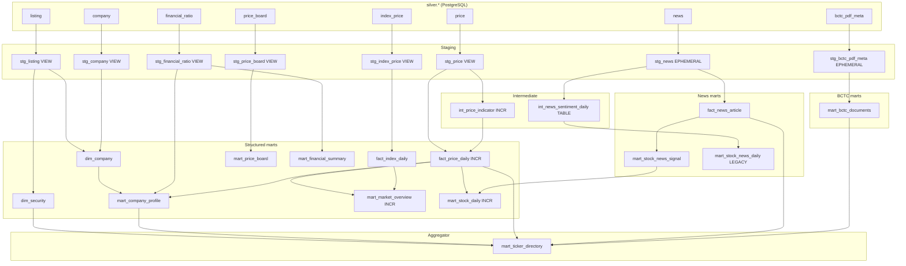

# Thông tin luồng tổng quan 

Tổng quan luồng dữ liệu của dự án này là một pipeline ELT kiểu medallion, đi theo chuỗi:

**nguồn dữ liệu bên ngoài → file local Bronze → transform Python → file local Silver → load vào PostgreSQL (`silver.*`) → dbt xử lý lên Gold/mart (`gold.*`) → backend API đọc mart → frontend hiển thị.**

Nói ngắn gọn hơn, mỗi lớp có vai trò như sau:

1. **Ingestion / Bronze**
   Hệ thống gọi nguồn ngoài như vnstock, RSS/HTML tin tức, HNX disclosure rồi **lưu dữ liệu thô xuống local** dưới dạng file partitioned trong `data-lake/raw/...`.
   Đây là lớp giữ dữ liệu gần với nguồn nhất để dễ backfill, debug, và chạy lại.

2. **Python transform / Silver files**
   Các script Python đọc Bronze, làm sạch và chuẩn hóa:
   - ép kiểu dữ liệu
   - đổi tên cột
   - dedupe
   - tính thêm field phụ
   - chuẩn hóa grain theo từng dataset

   Sau đó ghi lại thành **file local partition Silver** trong `data-lake/silver/...`.

3. **Load Silver vào database**
   Từ các file Silver parquet, hệ thống load/upsert vào PostgreSQL schema `silver`.
   Tức là lúc này dữ liệu đã vào DB nhưng vẫn còn ở mức khá gần dữ liệu nghiệp vụ gốc, chưa phải bảng phục vụ UI cuối cùng.

4. **dbt xử lý từ Silver lên Gold/mart**
   dbt đọc các bảng `silver.*` trong PostgreSQL rồi build các model:
   - `stg_*`: staging chuẩn hóa nhẹ
   - `int_*`: intermediate logic trung gian
   - `fact_*`, `dim_*`, `mart_*`: bảng Gold phục vụ truy vấn ứng dụng

   Đây là bước tạo ra các mart đã sẵn sàng cho dashboard/API.

5. **Backend API**
   FastAPI **không đọc file local** và cũng **không đọc Bronze/Silver parquet trực tiếp**.
   Backend chủ yếu query các bảng `gold.*` / mart đã được dbt xử lý sẵn, ví dụ:
   - giá cổ phiếu
   - tín hiệu news
   - BCTC
   - market overview
   - hồ sơ công ty

6. **Frontend**
   Frontend React gọi API backend, nhận JSON đã được backend/mart chuẩn bị sẵn, rồi render thành:
   - chart giá
   - bảng giá
   - tin tức
   - BCTC
   - hồ sơ mã cổ phiếu
   - dashboard thị trường

Nếu tóm lại thành một câu:

**Pipeline này lấy dữ liệu từ nguồn ngoài, lưu thô ở local, transform bằng Python thành Silver, nạp vào PostgreSQL, dùng dbt dựng các mart Gold, rồi backend lấy dữ liệu từ các mart đó để phục vụ frontend.**

# Thông tin luồng có cấu trúc

Phạm vi: **6 dataset** từ vnstock (không gồm news/BCTC): `price`, `index_price`, `listing`, `company`, `financial_ratio`, `price_board`. Nguồn duy nhất: thư viện **vnstock** (`Quote`, `Listing`, `Company`, `Finance`, `Trading`), fallback nguồn **kbs → vci**.

```text
vnstock API
  → ingestion/structure_data (Bronze Parquet)
  → pipeline/silver (Silver Parquet + _runs.jsonl)
  → warehouse.loader → PostgreSQL silver.*
  → transform/dbt → PostgreSQL gold.*
  → FastAPI / React
```

Điều phối: Airflow **`structured_daily`** (price, index, price_board) và **`structured_monthly`** (listing, company, financial_ratio). Python thực thi; Airflow lên lịch.

---

## 1. Sơ đồ tổng thể và phân nhóm dataset

```text
                    ┌─────────────────────────────────────────┐
                    │         listing (universe master)        │
                    │  Bronze: master/listing.parquet        │
                    │  Silver: listing/current                 │
                    └──────────────┬──────────────────────────┘
                                   │ ticker universe HOSE/HNX stock
         ┌─────────────────────────┼─────────────────────────┐
         ▼                         ▼                         ▼
    price (OHLCV)           company (profile)      financial_ratio (wide→long)
    index_price (5 chỉ số)  price_board (snapshot)
         │                         │                         │
         ▼                         ▼                         ▼
    silver.*  ──loader──►  dbt staging views  ──►  facts / dims / marts
```

| Dataset | Nguồn vnstock | Chế độ Bronze | Partition Bronze | Grain Silver | Khóa |
|---|---|---|---|---|---|
| `listing` | `Listing.symbols_by_exchange` / `all_symbols` | Snapshot ghi đè | `listing/master/listing.parquet` | `symbol` | `symbol` |
| `price` | `Quote.history` 1D | Merge theo tháng/ticker | `price/year=YYYY/month=MM/TICKER.parquet` | `ticker + trading_date` | `(ticker, trading_date)` |
| `index_price` | `Quote.history` 5 index | Merge theo tháng/index | `index/year=…/month=…/INDEX.parquet` | `index_code + trading_date` | `(index_code, trading_date)` |
| `company` | `Company.overview` / `profile` | Snapshot theo ngày chạy | `company/snapshots/snapshot_date=…/company_overview.parquet` | `ticker` | `ticker` |
| `financial_ratio` | `Finance.ratio` wide | 1 file/ticker/snapshot | `financial_ratio/snapshot_date=…/TICKER.parquet` | `ticker + item_code + period` | `(ticker, item_code, period)` |
| `price_board` | `Trading.price_board` | 1 snapshot/run | `price_board/snapshot_at=…/PRICE_BOARD_SNAPSHOT.parquet` | `symbol + trading_date` | `(symbol, trading_date)` |

---

## 2. Bronze — ingestion (`ingestion/structure_data/`)

### Entry point
- `run_structure_ingestion_pipeline()` — pipeline chính, có cờ `include_*`
- `run_structure_full_ingestion_pipeline()` — bật thêm `financial_ratio`
- `run_financial_ratio_ingestion_pipeline()` — chỉ ratio

Cấu hình: `IngestionConfig` (`config.py`) — universe, batch, rate limit, incremental, QC.

### Hai nhánh universe

**A. `use_listing_as_universe=True` (mặc định, monthly + notebook full):**
```text
listing → load tickers từ listing bronze → company → price (batch) → index → price_board → [financial_ratio]
```

**B. `use_listing_as_universe=False` (DAG daily watchlist50):**
```text
price → index → listing → company → [financial_ratio] → price_board
(dùng cfg.tickers cố định, không đọc listing trước price)
```

### `price` — incremental thật
- API: `Quote(source=kbs|vci).history(interval="1D")`
- Phạm vi fetch: `_resolve_price_fetch_range()` — full 5 năm, cửa sổ incremental, hoặc **per-ticker bronze watermark** (`use_bronze_ticker_watermark=True` trên DAG daily)
- Watermark đọc: `resolve_trading_date_watermark()` = max(gold, silver partition, `_watermark.json`)
- Ghi: `save_monthly_ticker_parquets()` → `price/year=YYYY/month=MM/SYMBOL.parquet` (**merge/append** trong file tháng, không xóa partition)
- QC: `validate_ohlcv_frame`, `min_ohlcv_rows_stock` / `_incremental`
- Metadata: `price/_runs/<run_date>.json`

### `index_price`
- 5 mã cố định: `VNINDEX`, `VN30`, `HNXINDEX`, `HNX30`, `UPCOMINDEX`
- Cùng pattern OHLCV; watermark không có `use_bronze_ticker_watermark` riêng như price
- Bronze path: `index/` (Silver đặt tên dataset `index_price`)

### `listing`
- Ghi đè `listing/master/listing.parquet` mỗi lần chạy
- Bronze **giữ raw**; Silver mới lọc `security_type=stock`

### `company`
- Gộp mọi ticker trong `cfg.tickers` vào **một** file:
  `company/snapshots/snapshot_date=<run_date>/company_overview.parquet`
- Retry đa nguồn kbs/vci; fallback method `overview` / `profile`

### `financial_ratio`
- Mỗi ticker → 1 parquet wide (`snapshot_date=<token>/TICKER.parquet`)
- Universe: giao `cfg.tickers` với listing HOSE/HNX (`financial_ratio_exchange_filter`)
- Retry + tắt nguồn lỗi tạm (`financial_ratio_disable_source_on_transient_error`)

### `price_board`
- **Một** `snapshot_at` mỗi run (`_ingest_price_board_snapshot`)
- Universe: listing (`price_board_use_listing_universe=True`) hoặc watchlist 50 (`DEFAULT_PRICE_BOARD_TICKERS`)
- Batched: fetch 50 mã/lần, gộp 1 snapshot

### Vận hành chung Bronze
- Rate limit: `rate_limit_rpm=50` (vnstock)
- Retry: `call_with_retry` + `tenacity`-style backoff
- Nghỉ giữa nhóm: `delay_between_categories_sec`
- Batch price: `price_batch_size=100`, nghỉ `delay_between_batches_sec`

---

## 3. Silver — `pipeline/silver/`

CLI: `python -m pipeline.silver.cli --dataset {price|index_price|listing|company|financial_ratio|price_board|all}`

Audit: `data-lake/silver/<dataset>/_runs.jsonl`

### 3.1 `price` / `index_price` (`price_transformer.py`)

**Input:** đọc toàn bộ bronze parquet theo glob; incremental Silver dùng watermark max(silver partition, gold).

**Biến đổi chính:**
- Chuẩn hóa cột OHLCV, alias date → `trading_date`
- `value` = API value hoặc `close × volume` → `value_is_derived`
- Dedupe `(ticker, trading_date)` keep last
- `is_suspicious` (boolean QC)

**Output:** `silver/price/trading_date=YYYY-MM-DD/PART-000.parquet` (một partition/ngày giao dịch)

**Watermark sau success:** `write_raw_watermark` (CLI) cho price/index

### 3.2 `listing` (`structure_transformer.py`)
- Lọc **chỉ stock** (`security_type=stock` hoặc `id=1`)
- Chuẩn hóa `symbol`, `exchange` (HOSE/HNX/UPCOM/UNKNOWN)
- Dedupe `symbol` keep last
- **Output:** `silver/listing/current/` — snapshot, không partition ngày

### 3.3 `company`
- Chuẩn hóa text, date (`dayfirst`), numeric
- Dedupe `ticker` keep last theo `snapshot_date`
- **Output:** `silver/company/current/`

### 3.4 `financial_ratio` (`financial_ratio_transformer.py`)

**Wide → long:**
- Cột dạng `2024-Q1`, `2024-year*` → melt thành `(ticker, item_code, period, value)`
- Watermark: `snapshot_date` token đầy đủ (không cắt date-only)
- Chỉ xử lý snapshot **mới hơn** watermark Silver hiện có
- **Output:** `silver/financial_ratio/period_type={quarter|annual}/year=YYYY/`

### 3.5 `price_board` (`price_board_transformer.py`)
- Đọc `snapshot_at=*` mới hơn watermark
- Flatten cột bid/ask/foreign; map `trading_date` từ snapshot
- **`dedupe_to_daily_latest`:** `(symbol, trading_date)` — giữ `snapshot_at` mới nhất trong ngày
- **Output:** `silver/price_board/trading_date=YYYY-MM-DD/`

---

## 4. Warehouse — `silver.*` (PostgreSQL/TimescaleDB)

Loader: `warehouse/loader/silver_loader.py` — `ON CONFLICT DO UPDATE`, batch 2000, `silver.load_audit`.

| Dataset | Bảng | PK / upsert key | Hypertable | Loader đặc biệt |
|---|---|---|---|---|
| `price` | `silver.price` | `(ticker, trading_date)` | Có (`trading_date`) | `--latest-partitions N` |
| `index_price` | `silver.index_price` | `(index_code, trading_date)` | Có | `--latest-partitions N` |
| `listing` | `silver.listing` | `symbol` | Không | full glob |
| `company` | `silver.company` | `ticker` | Không | full glob |
| `financial_ratio` | `silver.financial_ratio` | `(ticker, item_code, period)` | Không | full glob |
| `price_board` | `silver.price_board` | `(symbol, trading_date)` | Không | `--latest-partitions N` |

Thứ tự load `all`: price → index_price → listing → company → financial_ratio → price_board.

---

## 5. Gold dbt — lineage structured

### 5.1 Staging (views)

| Model | Nguồn | Vai trò |
|---|---|---|
| `stg_price` | `silver.price` | Cast dtype OHLCV |
| `stg_index_price` | `silver.index_price` | Cast index OHLCV |
| `stg_listing` | `silver.listing` | Dimension listing |
| `stg_company` | `silver.company` | Profile raw |
| `stg_financial_ratio` | `silver.financial_ratio` | Long ratios |
| `stg_price_board` | `silver.price_board` | Board snapshot |

### 5.2 Intermediate

**`int_price_indicator`** (incremental, `delete+insert`, key `ticker+trading_date`):
- Input: `stg_price`
- Tính: `daily_return`, MA7/20/50, RSI14 (Cutler SMA), MACD (SMA12−SMA26), Bollinger, `volume_ma20`, `obv`
- Incremental: tickers có ngày mới + **lookback 90 ngày**/ticker (cho MA/RSI/OBV)

### 5.3 Facts

| Model | Grain | Materialization | Nội dung |
|---|---|---|---|
| `fact_price_daily` | `ticker + trading_date` | **incremental** | `stg_price` LEFT JOIN `int_price_indicator` — OHLCV + toàn bộ indicator |
| `fact_index_daily` | `index_code + trading_date` | table | OHLCV 5 chỉ số từ `stg_index_price` |

### 5.4 Dimensions

| Model | Grain | Nguồn |
|---|---|---|
| `dim_security` | `symbol` | `stg_listing` |
| `dim_company` | `ticker` | `stg_company` LEFT JOIN `stg_listing` (bổ sung `organ_name`) |

### 5.5 Marts (structured chính)

| Mart | Grain | Upstream chính | API |
|---|---|---|---|
| `mart_stock_daily` | `ticker + trading_date` | `fact_price_daily` LEFT JOIN `mart_stock_news_signal` | `/prices`, `/indicators` |
| `mart_market_overview` | `trading_date` | Pivot `fact_index_daily` (VNINDEX/VN30/HNX) + agg `fact_price_daily` (volume, advances/declines) + top gainers/losers JSON | `/market/overview` |
| `mart_company_profile` | `ticker` | `dim_company` + latest price, 52w high/low, avg vol 20d, latest ratios | `/companies/{symbol}` |
| `mart_financial_summary` | `ticker + period` | Pivot wide từ `stg_financial_ratio` (~30 chỉ số); annual suy từ quarter nếu thiếu | `/financials/{symbol}` |
| `mart_price_board` | `symbol + trading_date` | `stg_price_board` + `foreign_net_volume`, `spread_pct`; lọc `is_suspicious` | `/board/{symbol}` |
| `mart_ticker_directory` | `ticker` | Union universe từ dim, company, price, news, BCTC + flags `has_*` | `/tickers` |

**Incremental Gold (structured):** `int_price_indicator`, `fact_price_daily`, `mart_stock_daily`, `mart_market_overview`.

**DAG `structured_daily` dbt subset:**
`fact_index_daily mart_price_board int_price_indicator fact_price_daily mart_stock_daily mart_market_overview`

**DAG `structured_monthly` dbt subset:**
`+mart_financial_summary +mart_company_profile` (kéo `dim_company`, `dim_security` upstream)

**`gold_full_refresh` 19:00:** `dbt run --full-refresh` toàn project.

---

## 6. Sơ đồ lineage Gold (structured)

```text
silver.price ──► stg_price ──► int_price_indicator ──┐
                              └──────────────────────┼──► fact_price_daily ──► mart_stock_daily
                                                     │         │
silver.index_price ──► stg_index_price ────────────┼──► fact_index_daily ──► mart_market_overview
                                                     │
silver.listing ──► stg_listing ──► dim_security ─────┼──► mart_ticker_directory
                                                     │
silver.company ──► stg_company ──► dim_company ──────┼──► mart_company_profile
                                                     │
silver.financial_ratio ──► stg_financial_ratio ────┴──► mart_financial_summary

silver.price_board ──► stg_price_board ──► mart_price_board
```

---

## 7. Airflow và chế độ vận hành

### `structured_daily` (T2–T6 16:30 ICT)
```text
bronze_structured (price+index+price_board, watchlist50, incremental 2 ngày, ticker watermark)
  → silver_price → silver_index_price → silver_price_board
  → load_silver (latest_partitions=7)
  → dbt_marts (incremental subset)
```

Env: `STRUCTURED_DAG_UNIVERSE=watchlist50|listing`, `STRUCTURED_MAX_TICKERS=N`.

### `structured_monthly` (ngày 1, 17:00 ICT)
```text
bronze (listing+company+financial_ratio, full HOSE/HNX)
  → silver_listing → silver_company → silver_financial_ratio
  → load_silver (full 3 dataset)
  → dbt_marts (+mart_financial_summary +mart_company_profile)
```

### Notebook backfill vs DAG
| | Notebook thường | DAG daily |
|---|---|---|
| Price universe | Full listing HOSE/HNX | 50 mã cố định |
| Price history | 5 năm backfill | +2 ngày/ticker |
| Listing/company | Cùng pipeline | Monthly riêng |
| Silver price history | Giữ toàn bộ partition | Chỉ thêm partition mới |

Sau backfill full listing, `silver.price` vẫn chứa lịch sử đầy đủ; DAG daily chỉ **cập nhật subset** mã.

---

## 8. Idempotency và watermark (tóm tắt)

| Tầng | price / index | listing / company | financial_ratio | price_board |
|---|---|---|---|---|
| Bronze | Merge file tháng; skip nếu watermark ≥ end | Ghi đè snapshot | File/ticker/snapshot mới | 1 snapshot/run |
| Silver | Partition `trading_date`; dedupe key | `current/` snapshot | Watermark `snapshot_date` | Dedupe latest `snapshot_at`/ngày |
| Warehouse | Upsert PK | Upsert PK | Upsert PK | Upsert PK |
| Gold incremental | delete+insert ngày mới (+ lookback indicator) | Full table rebuild khi chạy | Full table | Full table |

---

## 9. Phụ thuộc downstream (đã xác minh code)

| Endpoint | Gold object | Dataset structured |
|---|---|---|
| `GET /tickers` | `mart_ticker_directory` | listing, price, company, … |
| `GET /market/overview` | `mart_market_overview` | price, index |
| `GET /companies/{symbol}` | `mart_company_profile` | company, listing, price, ratio |
| `GET /prices/{symbol}` | `mart_stock_daily` | price |
| `GET /indicators/{symbol}` | `mart_stock_daily` | price + indicators |
| `GET /financials/{symbol}` | `mart_financial_summary` | financial_ratio |
| `GET /board/{symbol}` | `mart_price_board` | price_board |

---

## 10. Điểm cần lưu ý khi đọc hệ thống

1. **Không phải Lakehouse transaction log** — Parquet file + PostgreSQL warehouse.
2. **`listing` là universe master** nhưng DAG daily **không** refresh listing; dùng 50 mã cố định cho price/board.
3. **`financial_ratio` Bronze wide, Silver long, Gold wide lại** (`mart_financial_summary` pivot `item_code`).
4. **`mart_stock_daily` chứa cả giá, indicator và cột news** (join `mart_stock_news_signal` — luồng unstructured).
5. **`charter_capital`** có trong Silver/company nhưng UI không hiển thị (dữ liệu không tin cậy).
6. **Chỉ số HNX30, UPCOMINDEX** có trong Bronze/Silver nhưng `mart_market_overview` chỉ pivot **VNINDEX, VN30, HNXINDEX**.

---

Nếu cần đi sâu tiếp, có thể tách riêng từng dataset (ví dụ chỉ `financial_ratio` wide→long→pivot) hoặc so sánh watermark Bronze vs Silver vs Gold trên một mã cụ thể.

# Thông tin luồng tin tức

Đây là **batch ELT keyword-based**, không phải mô hình ML. Sentiment được **tính một lần ở Silver**; Gold chỉ **tái sử dụng** `sentiment_score`/`sentiment_label` đó để explode ticker, gán trọng số và tổng hợp theo phiên giao dịch.

---

## 1. Sơ đồ end-to-end

```text
sources.yaml (RSS + HTML)
  → ingest_news()                    [Bronze — chưa có sentiment]
  → data-lake/raw/.../news/{rss|html}/date=<run_date>/
  → transform_news()                 [Silver — sentiment keyword_v1 + ticker_mentions]
  → data-lake/silver/news/date=<run_date>/
  → silver_loader → silver.news
  → stg_news (ephemeral)             [explode ticker, ticker_relevance, source_tier]
  → fact_news_article                [grain: article_id + ticker]
  → mart_stock_news_signal           [grain: ticker + trading_date — weighted sentiment]
  → mart_stock_daily                 [LEFT JOIN news columns]
  → FastAPI /news/*, UI
```

**Partition quan trọng:** `date=<run_date>` ở Bronze/Silver = **ngày chạy job** (`NewsIngestionConfig.run_date` = `date.today()`), không phải `published_at`.

**Orchestration:** DAG `news_daily` (06:00 ICT) — `bronze_news` → `silver_news` (XCom partition) → `load_silver` → `dbt_marts` với selector `+mart_stock_news_signal +fact_news_article`.

---

## 2. Bronze — thu thập, chưa sentiment

### Nguồn
Cấu hình trong `ingestion/unstructured_data/sources.yaml`:
- **RSS:** VnExpress, CafeF, Vietstock (nhiều feed)
- **HTML:** VnExpress, CafeF, VnEconomy (`detail_mode: hybrid`)

### Entry point
`ingest_news()` trong `ingestion/unstructured_data/news_ingestor.py`:
1. Gọi `fetch_rss_news()` và `fetch_html_list_news()` song song theo config
2. Lọc `days_back` (DAG mặc định **1 ngày**)
3. `dedupe_news()` theo `(source, article_id)` — **không** dedupe cross-source
4. Ghi 2 file riêng:
   - `data-lake/raw/Unstructured_Data/news/rss/date=<YYYY-MM-DD>/PART-000.parquet`
   - `data-lake/raw/Unstructured_Data/news/html/date=<YYYY-MM-DD>/PART-000.parquet`

### Schema Bronze (không có sentiment)
`NEWS_COLUMNS` trong `ingestion/unstructured_data/schema.py`: `article_id`, `source`, `ticker`, `title`, `summary`, `body_text`, `url`, `published_at`, `fetched_at`, `language`, `raw_ref`.

### `article_id`
`compute_article_id()` — SHA256 của URL chuẩn hóa; fallback hash từ `source|published_at|ticker|title` nếu không có URL.

### Ticker sơ bộ ở Bronze
RSS/HTML gọi `infer_ticker_with_universe([title, summary, body], ticker_universe)` (`rss_adapter.py`, `html_list_adapter.py`).

Universe mặc định `NewsIngestionConfig`: `use_listing_tickers=False`, `tickers=[]` → universe có thể **rỗng** trừ khi bật listing hoặc set tickers. **Ticker đầy đủ được làm lại ở Silver** từ listing bronze.

### Rate limit / retry
`rate_limit_rpm=20`, `api_retry_max_attempts=4` trong `NewsIngestionConfig`.

---

## 3. Silver — nơi sentiment được sinh ra

Entry: `python -m pipeline.silver.cli --dataset news --run-partition <date> --strict`  
Logic: `transform_news()` trong `pipeline/silver/news_transformer.py`.

### 3.1 Gộp RSS + HTML
`_read_news_inputs()` đọc cả 2 stream cùng `run_partition`, gắn `_source_priority`: **html=0, rss=1** (HTML ưu tiên khi dedupe).

### 3.2 Dedupe cross-stream
Sort theo `article_id`, `_body_len` (dài hơn), `_has_published_at`, `_source_priority` → `drop_duplicates(["article_id"], keep="first")`.

→ Một bài xuất hiện cả RSS và HTML chỉ giữ **một bản**, ưu tiên HTML có body dài hơn.

### 3.3 Nhận diện ticker (Silver)
- Universe: `load_stock_universe(listing_bronze_path)` — mã `stock` từ listing parquet
- `find_mentions_in_parts([title, summary, body_text], universe)` — regex có blocklist (`CEO`, `USD`, `VND`, …) và negative patterns (`pipeline/silver/ticker_match.py`)
- `ticker_mentions`: danh sách mã, xếp theo confidence
- `ticker` primary: nếu bronze ticker ∈ mentions thì giữ; không thì `mentions[0]`

### 3.4 Sentiment — `keyword_v1` (chỉ Silver)

```60:79:pipeline/silver/news_transformer.py
POSITIVE_KEYWORDS = (
    "tăng", "vượt", "lãi", "lợi nhuận", "kỷ lục", "tích cực", "phục hồi", "khả quan",
)
NEGATIVE_KEYWORDS = (
    "giảm", "lỗ", "lao dốc", "sụt giảm", "áp lực", "cảnh báo", "tiêu cực", "thua lỗ",
)
```

**Công thức** (`_sentiment`):
```text
score = count(positive_keywords in combined_text) - count(negative_keywords in combined_text)
label = positive nếu score > 0
        negative nếu score < 0
        neutral nếu score = 0
```

- `combined_text` = nối `title + summary + body_text` (đã normalize)
- `sentiment_method` = cố định `"keyword_v1"`
- `sentiment_score` kiểu **Int64** (số nguyên, có thể >1 hoặc <-1)
- **Không** chuẩn hóa về [-1, 1] ở Silver

### 3.5 Output Silver
Ghi `data-lake/silver/news/date=<run_partition>/PART-000.parquet`  
Load vào `silver.news` (PK `article_id`, upsert idempotent; dedupe cross-partition khi load).

**Grain Silver:** `article_id` (một dòng/bài). Sentiment gắn **cả bài**, chưa tách theo ticker.

---

## 4. Warehouse → PostgreSQL `silver.news`

`warehouse/loader/silver_loader.py`: whitelist cột gồm `sentiment_score`, `sentiment_label`, `sentiment_method`, `ticker_mentions` (array).  
Upsert `ON CONFLICT (article_id) DO UPDATE`.

---

## 5. Gold dbt — từ Silver đến mart

### 5.1 `stg_news` (ephemeral) — bước quan trọng trước sentiment “theo ticker”

Đọc `silver.news`, lọc bài có `published_date`, `article_id`, `title` hợp lệ.

**Explode ticker:**
```text
all_tickers = distinct(ticker ∪ ticker_mentions)
→ unnest → một dòng / (article_id, ticker)
```

**Chỉ giữ bài có ít nhất một ticker** (`array_length(all_tickers, 1) > 0`). Bài không match ticker **không vào Gold**.

**Cột mới (chưa có ở Silver):**

| Cột | Logic |
|---|---|
| `ticker_relevance` | `title` nếu title chứa ticker; else `summary`; else `body` |
| `source_tier` | Vietstock=1, CafeF=2, còn lại=3 |

`sentiment_score` / `sentiment_label` **copy nguyên** từ Silver — cùng score cho mọi ticker của cùng bài.

`distinct on (article_id, ticker)` — ưu tiên relevance title > summary > body.

### 5.2 `fact_news_article` (table)

```12:29:transform/dbt/models/marts/fact_news_article.sql
select article_id, ticker, ticker_mentions, title, summary, body_text, url, source,
       published_at, published_date, sentiment_score, sentiment_label, word_count,
       language, ticker_relevance, source_tier
from {{ ref('stg_news') }}
```

- **Grain:** `article_id + ticker` (test unique trong `schema.yml`)
- **Materialization:** `table` (full rebuild khi DAG news chạy selector `+fact_news_article`)
- **API:** `GET /news/articles`, `/news/market`, `/news/{symbol}/articles` — kho tin, lọc `sentiment`, `relevance`, `published_date`

### 5.3 `int_news_sentiment_daily` (table, legacy path)

Tổng hợp theo **`ticker + published_date`** (lịch publish, **không** map phiên GD):

```text
news_count, avg(sentiment_score), positive/negative/neutral_count, dominant_sentiment (mode)
```

Chỉ dùng bởi **`mart_stock_news_daily`** — README đánh dấu **deprecated**; API/UI **không** đọc mart này.

### 5.4 `mart_stock_news_signal` (table — mart sentiment chính cho API/UI)

Đọc từ `fact_news_article`, thêm **ánh xạ phiên giao dịch** và **trọng số bài**:

**`trading_date`** (timezone `Asia/Ho_Chi_Minh`):
```text
Chủ nhật     → published_date + 1 ngày
Thứ bảy     → published_date + 2 ngày
Sau 14:30   → published_date + 1 ngày
Còn lại     → published_date
```

**`article_weight`** = relevance_weight × source_tier_weight × time_decay

| Thành phần | Giá trị |
|---|---|
| relevance | title=3.0, summary=2.0, body=1.0 |
| source_tier | tier 1=1.5, tier 2=1.2, else=1.0 |
| time_decay | `exp(-seconds_since_publish / (48×3600))` — half-life ~48h quanh `current_timestamp` lúc dbt chạy |

**Tổng hợp theo `ticker + trading_date`:**

| Cột | Công thức |
|---|---|
| `weighted_sentiment` | `Σ(sentiment_score × article_weight) / Σ(article_weight)` |
| `avg_sentiment_score` | `avg(sentiment_score)` — trung bình đơn giản |
| `news_signal` | `buy_signal` nếu weighted ≥ 0.3; `sell_signal` nếu ≤ -0.3; else `neutral` |
| `dominant_sentiment` | đếm label positive vs negative (không dùng weight) |
| `top_articles` | JSON top 3 bài theo `article_weight` |

**Grain:** `ticker + trading_date` (unique index).

**API:** `GET /news/{symbol}`, `/news/{symbol}/signal` → `gold.mart_stock_news_signal`.

### 5.5 `mart_stock_daily` (incremental)

```14:25:transform/dbt/models/marts/mart_stock_daily.sql
select fpd.*,
       coalesce(ns.news_count, 0) as news_count,
       ns.avg_sentiment_score, ns.weighted_sentiment,
       ns.dominant_sentiment, ns.news_signal, ns.top_articles
from fact_price_daily fpd
left join mart_stock_news_signal ns
  on fpd.ticker = ns.ticker and fpd.trading_date = ns.trading_date
```

Join tin vào mart giá theo **phiên GD**, không theo `published_date`. Chạy trong `structured_daily` dbt subset (sau khi `news_daily` đã populate signal).

---

## 6. Phân tầng sentiment — tóm tắt

| Tầng | Có sentiment? | Grain | Ghi chú |
|---|---|---|---|
| Bronze | Không | 1 dòng/bài/stream | Chỉ crawl + ticker sơ bộ |
| Silver | **Có** (`keyword_v1`) | `article_id` | Nguồn sự thật score/label |
| `silver.news` | Copy Silver | `article_id` | |
| `stg_news` | Copy + explode | `article_id + ticker` | + relevance, source_tier |
| `fact_news_article` | Copy | `article_id + ticker` | Archive/API chi tiết |
| `int_news_sentiment_daily` | Aggregate | `ticker + published_date` | Deprecated path |
| `mart_stock_news_daily` | Wrap trên | `ticker + published_date` | Deprecated |
| `mart_stock_news_signal` | **Weighted + signal** | `ticker + trading_date` | **Mart chính** |
| `mart_stock_daily` | Join cột news | `ticker + trading_date` | Dashboard giá+tín hiệu |

---

## 7. Ví dụ luồng một bài

```text
CafeF RSS: "FPT tăng mạnh sau báo cáo lợi nhuận"
  → Bronze rss/: article_id=sha256(url), ticker=FPT (nếu match)
  → Silver: dedupe, mentions=[FPT], score=+2 (tăng+lợi nhuận), label=positive
  → stg_news: 1 dòng (article_id, FPT), relevance=title, source_tier=2
  → fact_news_article: 1 dòng
  → mart_stock_news_signal:
       published 15:00 T4 → trading_date = cùng ngày
       weight = 3.0 × 1.2 × decay
       weighted_sentiment ≈ +2 (một bài)
       news_signal = buy_signal (≥ 0.3)
  → mart_stock_daily: ngày đó của FPT có news_signal, top_articles JSON
```

Bài nhắc **FPT và VCB**: Silver 1 dòng, score chung; `stg_news` **2 dòng** cùng score; `mart_stock_news_signal` tổng hợp **riêng** từng ticker.

---

## 8. Hạn chế thiết kế (từ code)

1. **Không phải ML** — đếm từ khóa tiếng Việt cố định; dễ false positive/negative.
2. **Score không chuẩn hóa** — ngưỡng `±0.3` trên `weighted_sentiment` thực chất là ngưỡng trên tổng có trọng số của số nguyên keyword count.
3. **Time decay phụ thuộc thời điểm `dbt run`** — không cố định theo `trading_date`.
4. **Bài không match ticker** có trong `silver.news` nhưng **không vào** `fact_news_article` / signal.
5. **Bronze vs Silver ticker** — universe Bronze mặc định có thể rỗng; matching đáng tin ở Silver (listing universe).
6. **`mart_stock_news_daily`** vẫn build nhưng không phục vụ API — dùng `mart_stock_news_signal` thay thế.

---

Nếu cần đi sâu thêm, có thể tách riêng: logic `ticker_match` (blocklist/scoring), hoặc so sánh `published_date` vs `trading_date` trên dữ liệu thực của một ticker cụ thể.

## Thông tin luồng BCTC PDF

# Luồng BCTC — kiến trúc và mô hình dữ liệu

Phạm vi đã xác minh từ code: crawl/tải **PDF báo cáo tài chính từ HNX**, lưu metadata + file, phục vụ tra cứu và xem PDF trên web. **Không có** OCR, trích xuất bảng số liệu, hay parser BCTC vào fact/mart tài chính.

```text
www.hnx.vn (AJAX list + file attach)
  → ingestion/semi_structure_data (Bronze: metadata Parquet + PDF files)
  → pipeline/silver/bctc_pdf_meta_transformer
  → silver.bctc_pdf_meta (PostgreSQL)
  → dbt: stg_bctc_pdf_meta → mart_bctc_documents
  → FastAPI /bctc/* → React (mở PDF inline hoặc redirect URL)
```

**Nguồn hiện tại:** chỉ `source=hnx` (`SemiStructuredIngestionConfig.sources`). HOSE chưa có provider.

**Partition quan trọng:** `date=<run_date>` = **ngày chạy job**, không phải `published_at` trên HNX.

---

## 1. Sơ đồ end-to-end

```text
┌─────────────────────────────────────────────────────────────────┐
│ BRONZE                                                          │
│  Crawl HNX (POST phân trang) → parse HTML → lấy URL PDF         │
│  Classify (rule-based) → filter download → stream PDF           │
│  Ghi:                                                           │
│    bctc_annual_pdf_meta/.../date=<run>/PART-000.parquet       │
│    bctc_annual_pdf/.../date=<run>/ticker=X/year=Y/<doc_id>.pdf │
└────────────────────────────┬────────────────────────────────────┘
                             ▼
┌─────────────────────────────────────────────────────────────────┐
│ SILVER  bctc_pdf_meta/date=<run>/PART-000.parquet               │
│  dedupe doc_id, period_key, display_status, is_available_for_web  │
└────────────────────────────┬────────────────────────────────────┘
                             ▼
┌─────────────────────────────────────────────────────────────────┐
│ WAREHOUSE  silver.bctc_pdf_meta  (PK doc_id, upsert)            │
└────────────────────────────┬────────────────────────────────────┘
                             ▼
┌─────────────────────────────────────────────────────────────────┐
│ GOLD  mart_bctc_documents  (lọc is_available_for_web)           │
└────────────────────────────┬────────────────────────────────────┘
                             ▼
  API + UI: danh sách, lọc, GET /bctc/{symbol}/file/{doc_id}
```

---

## 2. Entry point và cấu hình

| Thành phần | File / symbol |
|---|---|
| Pipeline wrapper | `run_bctc_annual_pipeline()` — `ingestion/semi_structure_data/pipeline.py` |
| Ingest chính | `ingest_bctc_annual_pdfs()` — `bctc_annual_pdf_ingestor.py` |
| Config | `SemiStructuredIngestionConfig` — `config.py` |
| Silver | `run_bctc_pdf_meta_silver()` — `pipeline/silver/bctc_pdf_meta_transformer.py` |
| Notebook | `ingestion/ingest_bctc_pdf_manager.ipynb` |
| Airflow | DAG `bctc_quarterly` → `ingest_bctc()` trong `common/tasks.py` |

### Tham số vận hành chính

| Tham số | Mặc định | Ý nghĩa |
|---|---|---|
| `hnx_max_list_pages` | 10 (DAG); 500 (backfill notebook) | Số trang list HNX (trang 1 = mới nhất) |
| `HNX_CRAWL_MAX_LIST_PAGES` | env override | Ghi đè số trang |
| `rate_limit_rpm` | 10 | Giới hạn request crawl/download |
| `min_pdf_bytes` | 20_000 | QC kích thước tối thiểu |
| `ingest_only_financial_statement_vi` | True | Chỉ **tải** BCTC VI (hợp nhất/riêng); metadata vẫn ghi mọi bản crawl |
| `BCTC_INGEST_ALL_CRAWLED_PDFS=1` | env | Tắt filter, tải mọi PDF đã crawl |
| `BCTC_ALLOW_EN_DOCS=1` | env | Cho phép tải bản EN |
| `hnx_verify_ssl` / `HNX_SSL_VERIFY` | False / env | SSL khi gọi www.hnx.vn |
| `HNX_RESUME_FROM_STATE=1` | env | Tiếp crawl từ `last_success_page` |

---

## 3. Bronze — crawl HNX

### 3.1 `fetch_hnx_annual_bctc_documents()` (`providers/hnx_disclosure_provider.py`)

**Nguồn gộp (dedupe `url_pdf`):**
1. **Crawl live HNX** — `_fetch_hnx_live_api_records()` (chính)
2. `data/hnx_sample.json` (dev/test)
3. `data/hnx_urls.csv` (bulk URL tùy chọn)

**Crawl live — từng bước:**

```text
POST https://www.hnx.vn/.../NextPageTinCPNY_CBTCPH  (page=1,2,…)
  → parse HTML fragment (_parse_hnx_list_rows)
  → mỗi dòng: ticker, title, published_at, article_id
  → POST ArticlesFileAttach (cache theo article_id)
  → mỗi attachment: url_pdf, attachment_name
  → year_guess từ title/published (_extract_year)
```

- **Phân trang:** `page` 1 → `hnx_max_list_pages`; dừng khi trang rỗng.
- **Resume:** `HNX_RESUME_FROM_STATE=1` đọc `Semi_Structure_Data/_state/hnx_crawl_state.json`, tiếp từ `last_success_page + 1`.
- **Rate limit + retry:** `wait_for_rate_limit`, `call_with_retry`.

**Lọc sau crawl (tùy chọn):**
- `strict_bctc_annual_keyword_filter=False` (mặc định): keyword BCTC rộng (`_is_bctc_candidate`).
- `strict_bctc_annual_keyword_filter=True`: thêm hint “năm”, “kiểm toán”, “hợp nhất”.
- `cfg.tickers` không rỗng → chỉ giữ ticker trong filter.

### 3.2 Phân loại tài liệu (`document_classifier.py`)

Rule-based, **không ML**:

| Bước | Output |
|---|---|
| `normalize_title_for_classify` | Bỏ dấu, lowercase, chuẩn hóa khoảng trắng |
| `detect_language` | `VI` / `EN` / `UNKNOWN` (tên file `_VI_`/`_EN_`, marker tiếng Việt/Anh) |
| `classify_doc_class` | `financial_statement_consolidated`, `financial_statement_separate`, `explanation`, `disclosure`, `announcement`, `unknown` |
| `infer_period_key` | `2024-Q1`, `2024-ANNUAL`, `2024-H1`, … |
| `canonical_priority` | Số nhỏ = ưu tiên cao (hợp nhất VI = 1, riêng VI = 2, …) |
| `keep_for_parse` | Candidate BCTC canonical (dự phòng parse sau; **chưa triển khai parser**) |
| `apply_canonical_selection` | Trong nhóm `(ticker, period_key)` chỉ giữ 1 bản `keep_for_parse=True` |

Gọi `enrich_document_row` + `apply_canonical_selection` **trước khi download** và **lại trong ingestor** sau khi gộp nguồn.

### 3.3 `doc_id`

```text
SHA1(source|ticker|title|published_at|url_pdf)
```

Hàm: `build_stable_doc_id()` — ổn định qua các lần chạy nếu metadata không đổi.

### 3.4 Download PDF (`downloader.py` + `ingest_bctc_annual_pdfs`)

**Quyết định tải:** `should_download_financial_pdf()`:
- Mặc định: chỉ `financial_statement_consolidated` / `financial_statement_separate` + ngôn ngữ VI (hoặc UNKNOWN nếu bật).
- Không tải: EN (trừ `BCTC_ALLOW_EN_DOCS`), giải trình, CBTT, unknown class → `status=skipped_ingest_filter`, **vẫn có dòng metadata**.

**Đường dẫn PDF:**
```text
data-lake/raw/Semi_Structure_Data/bctc_annual_pdf/
  source=hnx/date=<run_date>/ticker=<TICKER>/year=<YEAR>/<doc_id>.pdf
```

**Downloader:**
- Stream → `.part`, atomic rename
- Resume HTTP Range
- Retry mạng / 5xx; fail-fast 404/403
- Integrity: header `%PDF-`, `Content-Length`, `%%EOF`, `min_pdf_bytes`
- `sha256_file()` sau khi pass QC

**Metadata Bronze** (`bctc_annual_pdf_meta/.../PART-000.parquet`):

Mỗi dòng gồm: `doc_id`, `source`, `ticker`, `title`, `published_at`, `url_pdf`, `url_detail`, `year`, `ingest_date`, `pdf_path`, `file_size`, `sha256`, `pdf_valid_header`, `qc_pass`, `status`, `error`, classification fields, download telemetry (`http_status`, `attempts`, …).

**`status` điển hình:** `downloaded`, `skipped_ingest_filter`, `qc_failed`, `download_failed`.

**Ghi chú:** Một run ghi **toàn bộ** kết quả crawl (mọi status), không chỉ bản tải thành công.

---

## 4. Silver — `bctc_pdf_meta`

**Input:** `data-lake/raw/.../bctc_annual_pdf_meta/source=hnx/date=<run_partition>/PART-000.parquet`

**CLI:** `python -m pipeline.silver.cli --dataset bctc_pdf_meta --run-partition <YYYY-MM-DD>`

**Biến đổi:**

| Bước | Logic |
|---|---|
| Chuẩn hóa | `doc_id`, `ticker`, `published_at` (UTC, dayfirst), text fields |
| Dedupe | `doc_id` — ưu tiên `downloaded` > `qc_pass` > `file_size` |
| `period_key` | Bronze hoặc infer từ title (`Q1`…`ANNUAL`, `H1`, `9M`, `GENERAL`) |
| `display_status` | `available` nếu downloaded + qc_pass + có file/URL; `skipped` / `failed` / `unknown` |
| `is_available_for_web` | `display_status == 'available'` **và** có `pdf_path` hoặc `url_pdf` |

**Output:** `data-lake/silver/bctc_pdf_meta/date=<run_partition>/PART-000.parquet`

**Grain:** `doc_id` (một dòng/tài liệu).

**Partition Silver:** `date=` = ngày chạy job (cùng Bronze `run_date`).

---

## 5. Warehouse — `silver.bctc_pdf_meta`

| Thuộc tính | Giá trị |
|---|---|
| PK | `doc_id` |
| Unique phụ | `url_pdf` (partial index, WHERE NOT NULL) |
| Upsert | `ON CONFLICT (doc_id) DO UPDATE` |
| Dedupe load | `dedupe_on_load=True`, sort `run_partition`, `silver_loaded_at`, `published_at` |
| Audit | `silver.load_audit` |

Loader đọc **mọi** partition Silver `bctc_pdf_meta/**/*.parquet` (DAG quarterly load full dataset, không `--latest-partitions`).

---

## 6. Gold dbt

### `stg_bctc_pdf_meta` (ephemeral)

```sql
FROM silver.bctc_pdf_meta
WHERE display_status != 'error'      -- Silver dùng failed/skipped/available; 'error' legacy
  AND is_available_for_web = true
  AND doc_id IS NOT NULL
```

Chọn cột phục vụ web/API (không đưa `status`, `error`, `sha256`, `keep_for_parse` ra mart).

### `mart_bctc_documents` (table)

Pass-through từ `stg_bctc_pdf_meta` — **mart duy nhất** cho BCTC trên API.

| Cột | Mục đích |
|---|---|
| `doc_id` | Khóa tra cứu file |
| `ticker`, `year`, `period_key` | Lọc UI |
| `title`, `normalized_title` | Hiển thị + search |
| `published_at` | Sắp xếp, lọc `from`/`to` (ngày công bố HNX) |
| `doc_class`, `is_consolidated`, `canonical_priority` | Phân loại + sort ưu tiên |
| `display_status`, `is_available_for_web` | Trạng thái (API lọc lại `is_available_for_web`) |
| `url_pdf`, `pdf_path`, `file_size` | Stream local hoặc redirect |

**DAG selector:** `+mart_bctc_documents` (`DBT_BCTC_SELECT`).

**Không có:** fact BCTC số liệu, mart ratio từ PDF, lineage OCR.

---

## 7. API và frontend

### Backend (`backend/routers/bctc.py`)

| Endpoint | Gold | Hành vi |
|---|---|---|
| `GET /bctc/documents` | `mart_bctc_documents` | Kho toàn thị trường, phân trang, lọc ticker/year/q/date |
| `GET /bctc/recent` | `mart_bctc_documents` | Mới nhất (dashboard) |
| `GET /bctc/{symbol}` | `mart_bctc_documents` | Theo mã, lọc year/date |
| `GET /bctc/{symbol}/file/{doc_id}` | `mart_bctc_documents` | **FileResponse** `pdf_path` local; fallback **Redirect** `url_pdf` |

Sort: `canonical_priority ASC`, `published_at DESC`, `year DESC`.

### Frontend

| Trang / component | API |
|---|---|
| `/bctc` — `BctcArchivePage` | `/bctc/documents` |
| Dashboard — `RecentBctcList` | `/bctc/recent` |
| Stock detail — `BctcPanel` | `/bctc/{symbol}` |
| Mở PDF | `getBctcFileUrl` → `/bctc/{symbol}/file/{doc_id}` (tab mới) |
| `mart_ticker_directory` | `has_bctc`, `bctc_doc_count` |

---

## 8. Airflow — `bctc_quarterly`

| Thuộc tính | Giá trị |
|---|---|
| Schedule | 10:00 ICT, ngày **15** tháng 2, 5, 8, 11 |
| Chain | `bronze_bctc` → `silver_bctc` (XCom `run_partition`) → `load_silver` → `dbt_marts` |
| Bronze | `SemiStructuredIngestionConfig()`, 10 trang HNX, `include_download=True` |
| Retry | bronze retries=1 (10 phút) |

**Mô hình incremental thực tế:** **rescan top N trang + upsert `doc_id`** — không crawl theo ngày `published_at`. Mỗi quý quét lại disclosure gần nhất trên HNX.

---

## 9. Data contract tóm tắt

| Lớp | Đường dẫn / object | Grain | Key | Partition |
|---|---|---|---|---|
| Bronze meta | `.../bctc_annual_pdf_meta/source=hnx/date=*` | 1 dòng/PDF crawl | `doc_id` | `date`=run job |
| Bronze PDF | `.../bctc_annual_pdf/.../ticker=…/year=…/*.pdf` | 1 file/doc | `doc_id` filename | `date`, `ticker`, `year` |
| Silver | `silver/bctc_pdf_meta/date=*` | `doc_id` | `doc_id` | `date`=run job |
| PostgreSQL | `silver.bctc_pdf_meta` | `doc_id` | `doc_id` | `run_partition` |
| Gold | `mart_bctc_documents` | `doc_id` | `doc_id` | — (bảng flat) |

---

## 10. Hai “lớp lọc” — dễ nhầm

| Lớp | Khi nào | Ảnh hưởng |
|---|---|---|
| **Ingest download filter** | Bronze | Metadata **đủ** mọi bản crawl; PDF chỉ tải nếu pass `should_download_financial_pdf` |
| **Web filter** | Silver + Gold + API | Chỉ `is_available_for_web=true` lên mart và UI |

→ Có thể có nhiều dòng Silver (kể cả `skipped`) nhưng ít dòng trên `mart_bctc_documents`.

---

## 11. Idempotency

| Bước | Cơ chế |
|---|---|
| `doc_id` | Hash ổn định từ metadata → upsert an toàn |
| Crawl trùng URL | Dedupe `url_pdf` khi gộp nguồn |
| Silver | Dedupe `doc_id` keep bản downloaded/qc tốt nhất |
| Loader | Upsert `doc_id`; dedupe cross-partition theo `url_pdf` |
| PDF path | Cùng `doc_id` → cùng đường dẫn file (ghi đè khi tải lại thành công) |

---

## 12. Ngoài phạm vi / giới hạn (đã xác minh)

| Có | Chưa có |
|---|---|
| Crawl + metadata + PDF HNX | Crawl HOSE/HOSE disclosure |
| Phân loại rule-based (VI BCTC, quý/năm) | OCR / table extraction |
| Xem PDF trên dashboard | Parse số liệu BCTC vào warehouse |
| `keep_for_parse` flag | Pipeline parse PDF thực thi |
| Canonical chọn 1 bản/kỳ | Incremental theo ngày công bố HNX |

**Lưu ý vận hành:**
- API stream PDF từ **đường dẫn local** `pdf_path` — máy chạy API phải có file (cùng host với data-lake hoặc mount volume).
- `stg_bctc_pdf_meta` lọc `display_status != 'error'` trong khi Silver dùng `failed` — filter `'error'` có thể không loại thêm dòng nào.
- Notebook backfill **500 trang** vs DAG **10 trang** — cùng logic code, khác độ phủ disclosure.

---

Nếu cần đi sâu tiếp: chi tiết regex parse HTML HNX, ma trận `doc_class` × `status` × UI, hoặc so sánh partition `run_date` vs lọc API theo `published_at`.

# Thông tin chi tiết về Lineage SILVER to GOLD tổng quan


# Lineage Silver → Gold — tổng quan

Dự án dùng **dbt** trên PostgreSQL: **Silver** (`silver.*`) là nguồn đọc trực tiếp; **Gold** (`gold.*`) gồm **staging → intermediate → marts**. Nguồn sự thật là `transform/dbt/models/**` (không phải `warehouse/ddl/schema.sql` legacy).

---

## 1. Kiến trúc 3 lớp dbt

```text
┌─────────────────────────────────────────────────────────────────┐
│  SILVER (PostgreSQL) — 8 bảng, load từ Parquet Silver layer   │
│  price | index_price | listing | company | financial_ratio     │
│  price_board | news | bctc_pdf_meta                             │
└────────────────────────────┬────────────────────────────────────┘
                             │ source('silver', ...)
                             ▼
┌─────────────────────────────────────────────────────────────────┐
│  STAGING (gold.stg_*)                                           │
│  view (6) + ephemeral (2: stg_news, stg_bctc_pdf_meta)          │
│  Cast, rename, filter nhẹ — không persist (ephemeral inline)   │
└────────────────────────────┬────────────────────────────────────┘
                             │ ref()
                             ▼
┌─────────────────────────────────────────────────────────────────┐
│  INTERMEDIATE (gold.int_*)                                      │
│  int_price_indicator | int_news_sentiment_daily (legacy)        │
└────────────────────────────┬────────────────────────────────────┘
                             │
                             ▼
┌─────────────────────────────────────────────────────────────────┐
│  MARTS / FACTS / DIMS (gold.*)                                  │
│  fact_*, dim_*, mart_* — phục vụ API FastAPI                    │
└─────────────────────────────────────────────────────────────────┘
```

| Lớp | Materialization mặc định | Số model | Vai trò |
|---|---|---|---|
| `staging/` | `view` (2 ephemeral) | 8 | Đọc `silver.*`, chuẩn hóa cột |
| `intermediate/` | `table` | 2 | Logic nặng (indicator, aggregate legacy) |
| `marts/` | `table` / `incremental` | 18 | Fact, dim, mart cho API/UI |

---

## 2. Sơ đồ lineage đầy đủ



---

## 3. Bảng Silver → Staging → Gold (theo luồng)

### 3.1 Structured — giá & chỉ số

| Silver | Staging | Downstream Gold | Grain | Materialization |
|---|---|---|---|---|
| `silver.price` | `stg_price` | `int_price_indicator` → `fact_price_daily` → `mart_stock_daily`, `mart_market_overview`, `mart_company_profile` | `ticker + trading_date` | **INCR** (4 model) |
| `silver.index_price` | `stg_index_price` | `fact_index_daily` → `mart_market_overview` | `index_code + trading_date` | table |
| `silver.listing` | `stg_listing` | `dim_security`, `dim_company` → `mart_company_profile`, `mart_ticker_directory` | `symbol` | table |
| `silver.company` | `stg_company` | `dim_company` → `mart_company_profile` | `ticker` | table |
| `silver.financial_ratio` | `stg_financial_ratio` | `mart_financial_summary`, `mart_company_profile` (PE/PB/EPS/ROE/ROA) | `ticker + item + period` → pivot wide | table |
| `silver.price_board` | `stg_price_board` | `mart_price_board` | `symbol + trading_date` | table |

**Chuỗi giá chính (API chart/indicator):**

```text
silver.price
  → stg_price
  → int_price_indicator (MA, RSI, MACD, BB, OBV, daily_return)
  → fact_price_daily (giá + indicator)
  → mart_stock_daily (+ join mart_stock_news_signal)
```

**4 model incremental** (`delete+insert`, lookback ~90 ngày khi chạy daily DAG):
- `int_price_indicator`
- `fact_price_daily`
- `mart_stock_daily`
- `mart_market_overview`

`gold_full_refresh` (19:00) chạy `dbt run --full-refresh` toàn project.

---

### 3.2 News & sentiment

| Silver | Staging | Downstream Gold | Grain | Ghi chú |
|---|---|---|---|---|
| `silver.news` | `stg_news` (ephemeral) | `fact_news_article` | `article_id + ticker` | Explode `ticker` + `ticker_mentions`; thêm `ticker_relevance`, `source_tier` |
| | | `int_news_sentiment_daily` | `ticker + published_date` | **Legacy** — aggregate đơn giản |
| | | `mart_stock_news_daily` | `ticker + published_date` | **Deprecated** |
| | | `mart_stock_news_signal` | `ticker + trading_date` | **Mart chính** — map phiên GD, weighted sentiment, `news_signal` |
| `fact_news_article` | — | `mart_stock_news_signal` | | Không qua `int_news_sentiment_daily` |
| `mart_stock_news_signal` | — | `mart_stock_daily` | | LEFT JOIN theo `ticker + trading_date` |

**Luồng API chính:** `fact_news_article` (archive/bài viết) + `mart_stock_news_signal` (tín hiệu theo phiên).

---

### 3.3 BCTC PDF

| Silver | Staging | Downstream Gold | Grain | Filter |
|---|---|---|---|---|
| `silver.bctc_pdf_meta` | `stg_bctc_pdf_meta` (ephemeral) | `mart_bctc_documents` | `doc_id` | `is_available_for_web = true`, `display_status != 'error'` |

Không có intermediate; không parse số liệu từ PDF.

---

### 3.4 Mart tổng hợp (cross-flow)

| Model | Nguồn trực tiếp | Mục đích |
|---|---|---|
| `mart_ticker_directory` | `dim_security`, `mart_company_profile`, `fact_price_daily`, `fact_news_article`, `mart_bctc_documents` | Search box: `has_price`, `has_news`, `has_bctc`, counts, latest dates |
| `mart_company_profile` | `dim_company` + `fact_price_daily` (52w, volume) + `stg_financial_ratio` (ratio mới nhất) | Header trang mã |
| `mart_stock_daily` | `fact_price_daily` + `mart_stock_news_signal` | Chart + indicator + news inline trên cùng grain phiên GD |

---

## 4. Danh sách model Gold (28 SQL)

| Model | Loại | Materialized | Silver upstream (gốc) |
|---|---|---|---|
| `stg_price` | staging | view | `price` |
| `stg_index_price` | staging | view | `index_price` |
| `stg_listing` | staging | view | `listing` |
| `stg_company` | staging | view | `company` |
| `stg_financial_ratio` | staging | view | `financial_ratio` |
| `stg_price_board` | staging | view | `price_board` |
| `stg_news` | staging | ephemeral | `news` |
| `stg_bctc_pdf_meta` | staging | ephemeral | `bctc_pdf_meta` |
| `int_price_indicator` | intermediate | **incremental** | `price` |
| `int_news_sentiment_daily` | intermediate | table | `news` (legacy) |
| `fact_price_daily` | fact | **incremental** | `price` |
| `fact_index_daily` | fact | table | `index_price` |
| `fact_news_article` | fact | table | `news` |
| `dim_security` | dim | table | `listing` |
| `dim_company` | dim | table | `company` + `listing` |
| `mart_stock_daily` | mart | **incremental** | `price` + `news` |
| `mart_market_overview` | mart | **incremental** | `price` + `index_price` |
| `mart_price_board` | mart | table | `price_board` |
| `mart_financial_summary` | mart | table | `financial_ratio` |
| `mart_company_profile` | mart | table | `company` + `listing` + `price` + `financial_ratio` |
| `mart_stock_news_signal` | mart | table | `news` |
| `mart_stock_news_daily` | mart | table | `news` (legacy) |
| `mart_bctc_documents` | mart | table | `bctc_pdf_meta` |
| `mart_ticker_directory` | mart | table | đa luồng |

---

## 5. Airflow DAG → subset dbt

| DAG | Silver load | `dbt --select` |
|---|---|---|
| `structured_daily` | `price`, `index_price`, `price_board` | `fact_index_daily mart_price_board int_price_indicator fact_price_daily mart_stock_daily mart_market_overview` |
| `structured_monthly` | `listing`, `company`, `financial_ratio` | `+mart_financial_summary +mart_company_profile` |
| `news_daily` | `news` | `+mart_stock_news_signal +fact_news_article` |
| `bctc_quarterly` | `bctc_pdf_meta` | `+mart_bctc_documents` |
| `gold_full_refresh` | — | full project `--full-refresh` + test |

`+model` = model đó **và toàn bộ upstream** trong DAG dbt.

---

## 6. Gold → API (lineage phía consumer)

| UI / use case | Gold model | Endpoint | Khóa thời gian |
|---|---|---|---|
| Dashboard thị trường | `mart_market_overview` | `GET /market/overview` | `trading_date` |
| Chart giá + indicator | `mart_stock_daily` | `GET /prices/{symbol}`, `/indicators/{symbol}` | `trading_date` |
| News inline trên chart | `mart_stock_daily` (join signal) | `GET /prices/{symbol}` | `trading_date` |
| Bảng giá / foreign flow | `mart_price_board` | `GET /board/{symbol}`, `/foreign-flow` | `trading_date` |
| Hồ sơ công ty | `mart_company_profile` | profile API | snapshot |
| Chỉ số tài chính | `mart_financial_summary` | `GET /financials/{symbol}` | `period` / `year` / `quarter` |
| Tín hiệu tin | `mart_stock_news_signal` | `GET /news/{symbol}`, `/signal` | `trading_date` (mapped) |
| Archive tin | `fact_news_article` | `GET /news/articles` | `published_date` |
| BCTC | `mart_bctc_documents` | `GET /bctc/documents`, `/bctc/{symbol}` | `published_at::date` |
| Tìm mã | `mart_ticker_directory` | search / directory | — |

Backend **chỉ đọc `gold.*`** — không query trực tiếp `silver.*` từ API.

---

## 7. Điểm thiết kế quan trọng

1. **Staging ephemeral** (`stg_news`, `stg_bctc_pdf_meta`): không tạo object DB; SQL được inline vào model downstream.
2. **Join cross-domain duy nhất ở mart:** `mart_stock_daily` ← `mart_stock_news_signal`; `mart_ticker_directory` gom nhiều luồng.
3. **Incremental tập trung luồng giá:** 4 model; các mart khác full rebuild mỗi lần `dbt run` trong subset DAG.
4. **Legacy vẫn build:** `int_news_sentiment_daily`, `mart_stock_news_daily` — không dùng API chính.
5. **Grain khác nhau theo domain:** phiên GD (`trading_date`) vs ngày đăng tin (`published_date`) vs kỳ BCTC (`period_key` / `year`).

---

Tài liệu chi tiết cột từng model: [`Docs/dbt_outputs_and_lineage.md`](Docs/dbt_outputs_and_lineage.md). Nếu cần, có thể đi sâu lineage **một nhánh** (ví dụ chỉ `price → mart_stock_daily`, hoặc công thức `mart_stock_news_signal`).